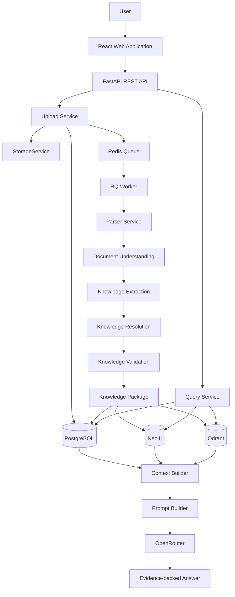

# 02_SYSTEM_ARCHITECTURE.md

# OmniOps - System Architecture
**Version:** 2.1.0  
**Status:** Living Architecture Specification

---

# Purpose

This document defines the software architecture of OmniOps.

It explains:
- major system components
- responsibilities
- communication flow
- document ingestion
- knowledge extraction
- GraphRAG pipeline
- AI reasoning pipeline

This document must be read before implementing any backend service.

---

# Product Philosophy

OmniOps is **not** a chatbot.

OmniOps is an Industrial Knowledge Intelligence Platform that transforms fragmented industrial documents into a continuously evolving organizational memory.

The chatbot is only one interface.

The real product is the knowledge layer.

---

# Locked Technology Decisions

| Concern | Selected Technology | Responsibility |
|---------|---------------------|----------------|
| Backend API | FastAPI | HTTP API and service orchestration |
| Knowledge Graph | Neo4j | Explicit industrial relationships and graph traversal |
| Vector Database | Qdrant | Semantic retrieval only |
| Relational Database | PostgreSQL | Users, document metadata, ingestion jobs, audit data, configuration |
| Queue | Redis + RQ | Background ingestion execution |
| LLM | OpenRouter | Reasoning only |
| File Storage | StorageService abstraction | Original document storage via pluggable backends |
| Embeddings | BAAI/bge-m3 (initial recommendation) | Open-source embeddings for long, multilingual industrial documents |

Notes:
- Qdrant does not replace Neo4j.
- PostgreSQL is not used for vector search.
- The LLM never accesses databases directly.

---

# Core Architecture



---

# Three Core Engines

## 1. Knowledge Engine

Responsible for converting documents into structured knowledge.

MVP inputs:
- Machine-readable PDF
- DOCX
- CSV

Future inputs:
- Scanned PDF
- XLSX
- Images
- P&ID
- TXT
- Email

Output:
- Knowledge Graph updates
- Vector embeddings
- Metadata
- Citations

Never answers user questions.

---

## 2. Retrieval Engine

Responsible for retrieving truthful context.

Responsibilities:
- metadata filtering
- semantic search
- graph traversal
- evidence ranking
- context assembly

Never calls the parser.

---

## 3. Intelligence Engine

Responsible for reasoning.

Uses:
- Context Builder
- Prompt Builder
- LLM

Provides:
- Copilot
- Maintenance
- Compliance
- Lessons Learned
- Executive Summary
- Alerts

Only the prompt changes between these capabilities.

---

# Detailed Knowledge Engine

The Knowledge Engine is divided into independent services.

Upload Service
    ->
Parser Service
    ->
Document Understanding
    ->
Knowledge Extraction Service
    ->
Knowledge Resolution Service
    ->
Knowledge Validation Service
    ->
Storage Service

Each service has one responsibility and one set of unit tests.

---

# Upload Service

Responsibilities:

- receive files
- validate file type
- assign document ID
- compute file hash
- store the original document through StorageService
- create document metadata in PostgreSQL
- create ingestion job metadata in PostgreSQL
- enqueue ingestion in Redis + RQ
- return a job ID immediately

Never parses documents.

Never waits for the ingestion worker to finish.

---

# Background Job Model

Uploads are asynchronous.

RQ workers perform:
- parsing
- document understanding
- knowledge extraction
- embeddings
- graph updates
- vector updates

Every ingestion job must be:
- idempotent
- retryable
- resumable
- traceable

Canonical job statuses:
- PENDING
- PROCESSING
- GRAPH_COMPLETE
- VECTOR_COMPLETE
- COMPLETED
- FAILED

---

# Parser Service

Every document type has its own parser.

Supported parsers:

| Type | Parser | Status |
|------|--------|--------|
| Machine PDF | PyMuPDF | MVP |
| DOCX | python-docx | MVP |
| CSV | pandas or csv module | MVP |
| Scanned PDF | OCR pipeline | Future |
| XLSX | openpyxl | Future |
| Images | OCR | Future |
| P&ID | Vision pipeline | Future |
| TXT | Native | Future |

Every parser outputs the same object.

```json
DocumentContent{
  document_id,
  pages,
  text,
  tables,
  images,
  metadata
}
```

---

# Universal Ingestion Pipeline

Every document follows the same lifecycle.

Upload

-> Document Classification

-> Specialized Parser

-> Document Understanding

-> Normalization

-> Knowledge Extraction

-> Knowledge Resolution

-> Knowledge Validation

-> Knowledge Package

-> Neo4j + Qdrant + PostgreSQL updates

-> Knowledge Ready

---

# Document Classification

Determine:

- MIME type
- digital or scanned
- language
- encoding
- parser to use

No knowledge extraction occurs here.

---

# Specialized Parsing

## Machine-readable PDF

Extract:
- text
- page numbers
- metadata
- tables
- images

No OCR.

## DOCX

Extract:
- headings
- paragraphs
- tables
- captions
- images

Preserve document hierarchy.

## CSV

Convert rows into structured JSON.

## Future Parsers

Future phases may add:
- scanned PDF OCR
- XLSX
- image OCR
- P&ID understanding

These must follow the same parser interface and return DocumentContent.

---

# Document Understanding

Purpose:
Preserve document structure before knowledge extraction.

Extract:
- sections
- headings
- captions
- reading order
- tables
- figure references

Output:
Structured DocumentContent with preserved hierarchy.

---

# Normalization

Every parser must produce one standard representation.

DocumentContent

-> clean text

-> structured pages

-> normalized dates and units

-> normalized metadata

Downstream services never need to know the original file type.

---

# Knowledge Extraction Service

Purpose:

Convert parsed content into industrial knowledge.

Extract:

## Entities

Examples:
- Pump P301
- Valve V12
- Bearing B12
- Work Order
- Engineer
- Area A

## Relationships

Examples:
- Pump HAS_COMPONENT Bearing
- Pump LOCATED_IN Area A
- Pump REFERENCES OEM Manual
- Engineer INSPECTED Pump

## Events

Extract:
- inspections
- maintenance
- shutdowns
- failures
- repairs
- replacements

## Rules

Examples:
- Replace bearing every 5000 hours.
- Pressure must remain below 12 bar.

## Parameters

Extract:
- temperature
- pressure
- RPM
- flow rate
- vibration

---

# Knowledge Resolution Service

Purpose:

Resolve extracted knowledge before it is written to storage systems.

Responsibilities:
- duplicate detection
- alias resolution
- conflicting fact tracking
- source authority handling
- confidence scoring
- provenance preservation

This service determines canonical facts without deleting competing evidence.

---

# Knowledge Validation Service

Purpose:

Prevent graph and vector pollution.

Checks:
- canonical entity resolution completed
- citations present
- timestamps valid
- relationship types valid
- metadata complete enough for storage
- confidence and provenance attached

Only validated knowledge becomes searchable.

---

# Knowledge Package

Every document produces one canonical object.

```json
{
  "document": {},
  "entities": [],
  "relationships": [],
  "events": [],
  "rules": [],
  "parameters": [],
  "chunks": [],
  "citations": [],
  "metadata": {},
  "resolution": {
    "canonical_entities": [],
    "conflicts": [],
    "source_authority": {}
  }
}
```

The original document is never queried again during reasoning.

The system reasons over the Knowledge Package.

---

# Storage Service

Original documents and extracted knowledge are stored separately.

## Original Document Storage

All original files are stored through StorageService.

Initial implementation:
- local filesystem

Future implementations:
- Azure Blob
- S3
- other object storage systems

No module outside storage should care where the file lives.

## Knowledge Storage

The validated Knowledge Package is persisted into specialized systems.

### PostgreSQL

Stores:
- users
- document metadata
- ingestion jobs
- audit data
- configuration

### Neo4j

Stores:
- entities
- relationships
- events
- asset hierarchy

Purpose:
- explicit reasoning

### Qdrant

Stores:
- semantic chunks
- embeddings
- citations
- metadata
- asset references

Purpose:
- semantic retrieval

### Redis + RQ

Stores:
- queued ingestion jobs
- worker execution state

Purpose:
- asynchronous processing

---

# Why Hybrid Storage?

Neo4j answers:

"What is connected?"

Qdrant answers:

"Where is this concept discussed?"

PostgreSQL answers:

"What metadata constraints and operational states apply?"

GraphRAG combines all three.

---

# Consistency Model

Do not assume atomic writes across Neo4j and Qdrant.

Instead:
- ingestion jobs must be idempotent
- retries must be safe
- partial progress must be resumable
- reconciliation must repair incomplete writes
- searchable knowledge must respect readiness and provenance metadata

The ingestion job lifecycle is the operational source of truth for pipeline progress.

---

# Retrieval Pipeline

Question
-> Intent Detection
-> Asset Detection
-> Metadata Search in PostgreSQL
-> Vector Search in Qdrant
-> Graph Expansion in Neo4j
-> Evidence Ranking
-> Context Builder
-> Prompt Builder
-> LLM

---

# Deployment Topology

Local development runs with Docker.

The local stack must include:
- FastAPI
- RQ worker
- PostgreSQL
- Neo4j
- Redis
- Qdrant

The architecture must remain cloud-portable.

---

# Authentication

Authentication and RBAC are not part of the MVP.

However:
- route boundaries should remain auth-ready
- data access should remain easy to scope later
- auditability should not depend on future redesign

---

# Design Rules

- Business logic never belongs in API routes.
- No module outside storage persists original files directly.
- LLM never accesses databases directly.
- Every answer must include citations.
- Neo4j is the source of relationships.
- Qdrant is the source of semantic recall.
- PostgreSQL is the source of application metadata and ingestion job state.
- Every upload enriches organizational memory.

---

# Dependencies

Requires:
- 01_CONTEXT.md
- 00_TASK_MASTER.md

Next:
03_GRAPH_SCHEMA.md
