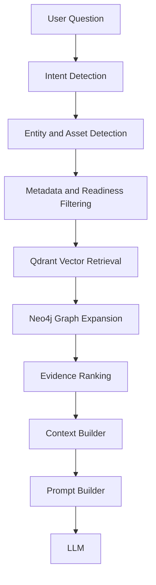

# 05_RETRIEVAL_ENGINE.md

# OmniOps Retrieval Engine Specification
Version: 1.1.0
Status: Living Specification

---

# Purpose

The Retrieval Engine is the runtime brain of OmniOps.

Its responsibility is not to answer questions.

Its responsibility is to assemble the highest quality, evidence-backed context for the LLM.

The LLM should never retrieve data directly.

Instead, it receives a curated Context Package built by the Retrieval Engine.

---

# Responsibilities

The Retrieval Engine is responsible for:

- understanding the user's intent
- identifying referenced assets
- applying metadata filters from PostgreSQL
- retrieving semantic evidence from Qdrant
- retrieving structural evidence from Neo4j
- combining graph and vector search
- ranking evidence
- building the Context Package
- passing structured context to the Prompt Builder

The Retrieval Engine never:
- parses documents
- writes to databases
- modifies the Knowledge Graph
- generates answers

---

# Retrieval Philosophy

Graph answers:

"What is connected?"

Vector Search answers:

"Where is this concept discussed?"

Metadata answers:

"What constraints apply?"

GraphRAG combines all three.

Retrieval must only use knowledge that is valid, traceable, and ready for search.

---

# Runtime Data Sources

## PostgreSQL

Used for:
- document metadata
- document type filters
- date filters
- plant and department filters
- ingestion readiness state
- audit and provenance lookups

## Qdrant

Used for:
- semantic chunk retrieval
- embedding similarity search

## Neo4j

Used for:
- asset neighborhood expansion
- event and maintenance history traversal
- regulation and related-document traversal

---

# Retrieval Pipeline



---

# Stage 1 - Intent Detection

Determine the purpose of the question.

Supported intents include:

- Maintenance
- Compliance
- Asset Lookup
- Troubleshooting
- Explanation
- Summary
- Timeline
- Root Cause Analysis

Output:

```json
{
  "intent": "maintenance"
}
```

Acceptance:

Correctly classify sample prompts.

---

# Stage 2 - Asset Detection

Identify referenced entities.

Example:

"Why is Pump P301 vibrating?"

Detected asset:

Pump P301

If multiple assets exist, return all candidates with confidence.

Acceptance:

Known asset IDs detected correctly.

---

# Stage 3 - Metadata and Readiness Filtering

Reduce search scope using:

- asset ID
- document type
- date
- plant
- department
- regulation
- document version
- ingestion readiness state

Purpose:

Reduce irrelevant or incomplete retrieval.

The retrieval engine must avoid surfacing evidence from knowledge that is not ready for search.

---

# Stage 4 - Vector Retrieval

Retrieve semantically similar chunks from Qdrant.

Input:

Question embedding.

Output:

Top-k chunks.

Each result contains:

- chunk
- document_id
- page
- score
- metadata

Acceptance:

Relevant chunks returned.

---

# Stage 5 - Graph Expansion

Expand the Neo4j neighborhood of retrieved assets.

Examples:

Asset

-> Components

-> Events

-> Maintenance History

-> Regulations

-> Related Documents

Purpose:

Provide structural context.

Acceptance:

Neighbor traversal succeeds.

---

# Stage 6 - Evidence Ranking

Merge graph and vector results.

Ranking considers:

- semantic similarity
- graph distance
- document authority
- confidence
- recency
- source priority
- provenance completeness

Higher quality evidence appears first.

---

# Stage 7 - Context Builder

Create one Context Package.

Example:

```json
{
  "question": "",
  "intent": "",
  "assets": [],
  "documents": [],
  "graph": {},
  "chunks": [],
  "timeline": [],
  "citations": []
}
```

This package is the only input to the Prompt Builder.

---

# Prompt Builder

Combine:

- system prompt
- Context Package
- user question

Generate the final prompt for the LLM.

No additional retrieval happens after this point.

---

# LLM Interaction

The LLM receives:

- structured context
- evidence
- citations
- user question

The LLM must reason only over supplied information.

If evidence is insufficient, the response should explicitly state that.

---

# Error Handling

Possible failures:

- no relevant chunks
- unknown asset
- empty graph expansion
- missing citations
- context overflow
- partial lag between graph and vector stores

Fallback strategy:

1. Metadata only
2. Vector only
3. Graph only
4. Combined retrieval
5. Ask clarification

Even in fallback mode, the system must preserve citation discipline.

---

# Acceptance Criteria

The Retrieval Engine is complete when:

- intent detection works
- asset detection works
- metadata filtering works
- readiness filtering works
- vector retrieval works
- graph expansion works
- Context Package generated
- prompt assembled
- answers include citations

---

# Micro-task Mapping

RET-001 Intent Detection

RET-002 Asset Detection

RET-003 Metadata Search

RET-004 Vector Retrieval

RET-005 Graph Expansion

RET-006 Evidence Ranking

RET-007 Context Builder

RET-008 Prompt Builder

RET-009 Retrieval Tests

---

# Coding Agent Notes

Load the following before implementing retrieval tasks:

- 01_CONTEXT.md
- 00_TASK_MASTER.md
- 02_SYSTEM_ARCHITECTURE.md
- 03_GRAPH_SCHEMA.md
- 04_INGESTION_PIPELINE.md
- 05_RETRIEVAL_ENGINE.md

Ignore ingestion-specific implementation unless explicitly required.

The Retrieval Engine consumes knowledge; it never creates it.

---

Dependencies:

- 01_CONTEXT.md
- 00_TASK_MASTER.md
- 02_SYSTEM_ARCHITECTURE.md
- 03_GRAPH_SCHEMA.md
- 04_INGESTION_PIPELINE.md

Next:
Begin implementation using the relevant RET-* task files.
