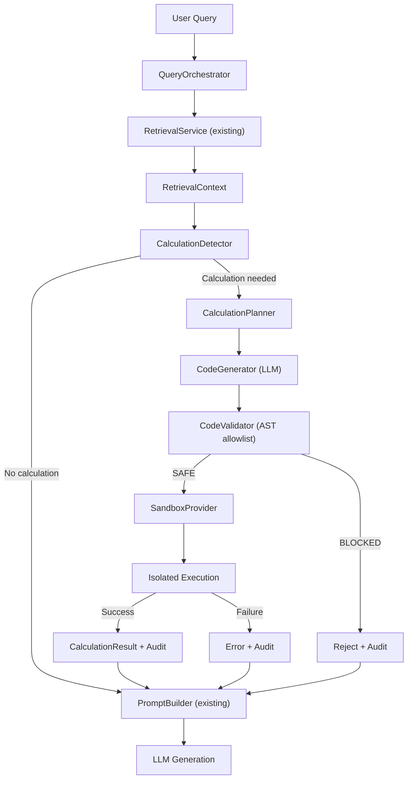

# V15-SANDBOX-ARCH-001 — Architecture Approval Report

> [!IMPORTANT]
> **NO CODE HAS BEEN WRITTEN. THIS IS THE ARCHITECTURE APPROVAL REPORT.**
>
> Implementation begins only after explicit developer approval.

---

## A. Repository Findings

### A.1 Current Docker Architecture

Inspected from [`docker-compose.yml`](file:///d:/ET%20hackathon/OmniOps/docker-compose.yml), [`backend/Dockerfile`](file:///d:/ET%20hackathon/OmniOps/backend/Dockerfile), [`render.yaml`](file:///d:/ET%20hackathon/OmniOps/render.yaml), [`DEPLOYMENT.md`](file:///d:/ET%20hackathon/OmniOps/DEPLOYMENT.md).

```text
┌──────────────────────────────────────────────────────────────────┐
│                     Docker Compose Stack                         │
│                                                                  │
│  ┌─────────────┐  ┌──────────────┐  ┌──────────────────────┐    │
│  │ omniops-api │  │omniops-worker│  │   omniops-frontend   │    │
│  │  (FastAPI)  │  │  (RQ worker) │  │   (Next.js/Node)     │    │
│  │ python:3.12 │  │ python:3.12  │  │   node:20-alpine     │    │
│  │ port 8000   │  │  no ports    │  │   port 3000          │    │
│  └──────┬──────┘  └──────┬───────┘  └──────────────────────┘    │
│         │                │                                       │
│  ┌──────┴────────────────┴───────────────────────────────┐      │
│  │              Default Bridge Network                    │      │
│  │   (all services can communicate by container name)     │      │
│  └──────┬────────────┬──────────────┬───────────┬────────┘      │
│         │            │              │           │                │
│  ┌──────┴──────┐ ┌───┴────┐ ┌──────┴──────┐ ┌──┴─────┐        │
│  │  postgres   │ │  redis │ │    neo4j    │ │ qdrant │        │
│  │ 16-alpine   │ │7-alpine│ │5.22-commun.│ │ v1.10  │        │
│  │ port 5432   │ │  6379  │ │ 7474/7687  │ │ 6333   │        │
│  └─────────────┘ └────────┘ └────────────┘ └────────┘        │
└──────────────────────────────────────────────────────────────────┘

                    ┌──────────────┐
                    │  Ollama      │
                    │  (HOST)      │
                    │  port 11434  │
                    └──────────────┘
                    Accessed via host.docker.internal:11434
```

**Key observations:**

| Finding | Detail |
|---------|--------|
| **No explicit Docker network** | Uses Docker Compose default bridge. All 6 services can reach each other by container name. |
| **No Docker socket mounted** | Neither `api` nor `worker` currently has `/var/run/docker.sock` access. |
| **Ollama on host** | Not containerized. Accessed via `host.docker.internal:11434`. The `ollama/Dockerfile` exists but is not referenced in `docker-compose.yml`. |
| **Shared volumes** | `storage_data` is shared between `api` and `worker`. All databases have separate named volumes. |
| **GPU access** | Both `api` and `worker` have NVIDIA GPU reservations. |
| **Base image** | `python:3.12-slim` — no security hardening, runs as root. |
| **No auth/authz** | No authentication or authorization system exists. |

### A.2 Current API ↔ Worker Relationship

Inspected from [`worker.py`](file:///d:/ET%20hackathon/OmniOps/backend/worker.py), [`ingestion/orchestrator.py`](file:///d:/ET%20hackathon/OmniOps/backend/ingestion/orchestrator.py), [`ingestion/execution_strategy.py`](file:///d:/ET%20hackathon/OmniOps/backend/ingestion/execution_strategy.py).

```text
User Upload → API → Redis Queue → Worker → Ingestion Pipeline
```

- API enqueues jobs to Redis via RQ (or BackgroundTasks on Windows).
- Worker (`worker.py`) is a separate container running `python worker.py`.
- Worker uses `SimpleWorker` on Windows (no fork), `Worker` on Linux.
- Both API and Worker share the same codebase (same Dockerfile).

### A.3 Current Network Topology

```text
api ←→ postgres     (bolt://postgres:5432)
api ←→ redis        (redis:6379)
api ←→ neo4j        (bolt://neo4j:7687)
api ←→ qdrant       (http://qdrant:6333)
api ←→ ollama       (http://host.docker.internal:11434)
worker ←→ same      (identical environment variables)
```

No network restrictions between any containers. Any container can reach any other.

### A.4 Current Task Execution Mechanism

Inspected from [`ingestion/execution_strategy.py`](file:///d:/ET%20hackathon/OmniOps/backend/ingestion/execution_strategy.py).

- `BackgroundTaskStrategy` — in-process, Windows dev
- `RQExecutionStrategy` — Redis/RQ, Linux production
- Auto-selected based on platform and Redis availability

### A.5 Existing Ollama Integration

Inspected from [`generation/openrouter_provider.py`](file:///d:/ET%20hackathon/OmniOps/backend/generation/openrouter_provider.py), [`generation/vision_provider.py`](file:///d:/ET%20hackathon/OmniOps/backend/generation/vision_provider.py).

- **OpenRouterLLMProvider**: Uses OpenRouter-compatible REST API (pointed at Ollama's `/v1` endpoint for local dev).
- **VisionProvider**: Uses Ollama's native `/api/chat` endpoint directly.
- Both use `urllib.request` (stdlib), no `httpx`/`requests`.
- Model: `llama3.2` (reasoning), `gemma4:e2b` (vision).

### A.6 Existing Abstractions Relevant to Sandbox

- [`query/orchestrator.py`](file:///d:/ET%20hackathon/OmniOps/backend/query/orchestrator.py) — The integration point. Calculation detection + injection would go between retrieval (line 56) and generation (line 114).
- [`retrieval/retrieval_models.py`](file:///d:/ET%20hackathon/OmniOps/backend/retrieval/retrieval_models.py) — `RetrievalContext` is the data contract. Calculation results could be added here.
- [`generation/prompt_builder.py`](file:///d:/ET%20hackathon/OmniOps/backend/generation/prompt_builder.py) — Formats context for LLM. Would need to include calculated results.
- `agents/` — Empty directory (only `.gitkeep`). No existing agent/tool framework.

---

## B. Proposed Sandbox Architecture

### B.1 High-Level Architecture



### B.2 Sandbox Provider Abstraction

```text
CalculationService
    │
    ├── CalculationDetector      (is calculation needed?)
    ├── CalculationPlanner       (extract inputs from context)
    ├── CodeGenerator            (LLM generates Python code)
    ├── CodeValidator            (AST allowlist check)
    └── SandboxProvider          (abstract)
            │
            ├── DockerSandboxProvider       (production/prototype)
            │     └── Ephemeral container
            │         - python:3.12-slim base
            │         - No network (--network none)
            │         - Read-only filesystem
            │         - Non-root user
            │         - Tmp writable dir (ephemeral)
            │         - Resource limits (memory, CPU, PID)
            │         - Execution timeout
            │
            └── SubprocessSandboxProvider   (fallback/testing)
                  └── subprocess.run()
                      - RestrictedPython AST check
                      - timeout parameter
                      - No shell=True
                      - Empty environment
```

### B.3 Sandbox Container Design (DockerSandboxProvider)

The sandbox container would be a **separate, pre-built image** added to docker-compose.yml as a **build-only image** (not a running service). The API or worker creates ephemeral instances of it.

```dockerfile
# docker/sandbox/Dockerfile
FROM python:3.12-slim

# Create non-root user
RUN groupadd -r sandbox && useradd -r -g sandbox -d /sandbox -s /bin/false sandbox

# Create isolated workspace
RUN mkdir -p /sandbox/work && chown sandbox:sandbox /sandbox/work

# Install only allowed stdlib (already in python:3.12-slim)
# No pip install. No additional packages.

# Remove dangerous binaries
RUN rm -f /usr/bin/wget /usr/bin/curl 2>/dev/null; true

# Switch to non-root user
USER sandbox
WORKDIR /sandbox/work

# Entrypoint reads code from stdin, executes, writes result to stdout
COPY --chown=sandbox:sandbox entrypoint.py /sandbox/entrypoint.py
ENTRYPOINT ["python", "/sandbox/entrypoint.py"]
```

The entrypoint:
1. Reads JSON from stdin: `{"code": "...", "inputs": {...}}`
2. Applies RestrictedPython AST validation (defense in depth)
3. Executes the validated code with only `inputs` in scope
4. Writes JSON to stdout: `{"result": "...", "error": "...", "exit_code": 0}`
5. Exits

### B.4 Container Execution Parameters

```text
docker run \
    --rm                            # Ephemeral: destroy after execution
    --network none                  # ZERO network access
    --read-only                     # Read-only root filesystem
    --tmpfs /sandbox/work:size=10m  # Small writable tmpfs
    --memory 128m                   # Memory limit (Python itself needs ~30-50MB)
    --cpus 0.5                      # CPU limit
    --pids-limit 20                 # Process limit
    --user sandbox                  # Non-root
    --no-new-privileges             # Prevent privilege escalation
    --security-opt no-new-privileges
    --cap-drop ALL                  # Drop all Linux capabilities
    -i                              # Stdin for code input
    omniops-sandbox:latest          # Pre-built image
```

### B.5 Integration into QueryOrchestrator

The calculation step inserts between retrieval and generation:

```text
answer_query()
    │
    ├── 1. RetrievalService.retrieve()     (existing)
    │
    ├── 2. CalculationService.evaluate()   (NEW)
    │       ├── CalculationDetector.needs_calculation(query, context)
    │       ├── CalculationPlanner.extract_inputs(query, context)
    │       ├── CodeGenerator.generate(query, inputs)
    │       ├── CodeValidator.validate(code)
    │       └── SandboxProvider.execute(code, inputs)
    │
    ├── 3. Inject CalculationResult into context
    │
    └── 4. GenerationService.generate_answer()  (existing)
```

### B.6 Module Structure

```text
backend/
  calculation/
    __init__.py
    detector.py              # Determines if query needs calculation
    planner.py               # Extracts structured inputs from context
    code_generator.py        # Prompts LLM to generate code
    validator.py             # AST allowlist validation
    sandbox_provider.py      # Abstract SandboxProvider
    docker_sandbox.py        # DockerSandboxProvider implementation
    subprocess_sandbox.py    # SubprocessSandboxProvider (fallback)
    models.py                # CalculationRequest, CalculationResult, CalculationAudit
    service.py               # CalculationService (orchestrates the pipeline)
```

---

## C. Security Analysis

### C.1 Filesystem Isolation

| Layer | Mechanism | What it blocks |
|-------|-----------|----------------|
| **Container** | `--read-only` root FS + `--tmpfs /sandbox/work:size=10m` | Cannot write to image FS; tmpfs destroyed on exit |
| **Container** | No volume mounts to host or `storage_data` | Cannot access uploaded docs, `.env`, source code |
| **Container** | Image contains no app source code, no `.env`, no credentials | Even if code escapes Python, nothing sensitive exists |
| **Python** | AST validator blocks `open()`, `pathlib`, `os.path`, `io` | Defense-in-depth even if container FS were accessible |

### C.2 Network Isolation

| Layer | Mechanism | What it blocks |
|-------|-----------|----------------|
| **Container** | `--network none` | Zero network interfaces. Cannot reach internet, localhost, postgres, redis, neo4j, qdrant, ollama, or the API itself |
| **Python** | AST validator blocks `socket`, `urllib`, `requests`, `http` | Defense-in-depth |

**Note**: `--network none` is enforced by the Docker daemon at the Linux kernel level (network namespacing). It cannot be bypassed from inside the container.

### C.3 Process Isolation

| Layer | Mechanism | What it blocks |
|-------|-----------|----------------|
| **Container** | `--pids-limit 20` | Fork bombs |
| **Container** | `--cap-drop ALL` | Cannot use raw sockets, mount filesystems, change user, etc. |
| **Container** | `--no-new-privileges` | Cannot escalate via setuid binaries |
| **Container** | `--user sandbox` (non-root) | Cannot modify system files even if FS were writable |
| **Python** | AST validator blocks `subprocess`, `os.system`, `os.exec*` | Defense-in-depth |

### C.4 Resource Limits

| Resource | Limit | Rationale |
|----------|-------|-----------|
| Memory | 128 MB | Python 3.12-slim baseline is ~30-50MB; 128MB allows computation headroom |
| CPU | 0.5 cores | Sufficient for math; prevents CPU starvation of main app |
| PIDs | 20 | Python needs ~3-5 PIDs; 20 allows normal operation while blocking forks |
| Execution timeout | 5 seconds | Enforced by API-side timer + `docker kill` |
| Stdout | 10 KB | Enforced by API reading limited bytes from container output |
| Stderr | 10 KB | Same |
| Tmpfs | 10 MB | Only writable space; destroyed on exit |

### C.5 Secret Isolation

| Risk | Mitigation |
|------|------------|
| Environment variables (DB passwords, API keys) | Sandbox container receives ZERO env vars (not part of docker-compose env) |
| `.env` file | Not mounted into sandbox container |
| Application source code | Not copied to sandbox image (separate Dockerfile) |
| Database credentials | No network access to reach databases even if credentials were known |
| Docker socket | Not mounted (see C.6) |

### C.6 Docker Socket Implications

> [!CAUTION]
> **The current Docker Compose stack does NOT mount `/var/run/docker.sock` into any container.**

To create sandbox containers, the API or worker needs one of these mechanisms:

| Option | Security | Complexity | Recommendation |
|--------|----------|------------|----------------|
| **A. Mount Docker socket into API container** | ⚠️ DANGEROUS — grants full Docker daemon control. Container could stop/start other services, read volumes, exec into other containers. | Low | **NOT recommended** |
| **B. Dedicated sandbox-manager sidecar** | ✅ The sidecar has Docker socket access but exposes only a restricted gRPC/HTTP API for "run sandbox" operations. API talks to sidecar, never touches Docker socket. | Medium | **Recommended for production** |
| **C. Pre-launch sandbox containers from docker-compose** | ✅ Sandbox container runs as a service, API communicates via a minimal IPC channel (e.g., stdin/stdout via `docker exec`). But this makes it non-ephemeral. | Low | **Possible but less clean** |
| **D. Use `subprocess` + `RestrictedPython` only (no Docker sandbox)** | ⚠️ No OS-level isolation. Python sandbox only. | Very Low | **Acceptable for prototype only** |

**This is Open Decision #1 — see section D.**

### C.7 Escape Risks

| Attack Vector | Mitigation |
|---------------|------------|
| Python AST bypass (e.g., `getattr(__builtins__, 'open')`) | AST allowlist + container isolation (no files to access anyway) |
| C extension exploit | No numpy/pandas/ctypes; only stdlib pure-Python modules |
| Kernel exploit from container | `--cap-drop ALL`, `--no-new-privileges`, non-root user; kernel exploits are very rare |
| Docker escape | No Docker socket, no privileged mode, standard Docker containment |
| Resource exhaustion | Memory, CPU, PID, timeout limits |

### C.8 Prototype Limitations

| Limitation | Acceptable for prototype? | Production fix |
|------------|--------------------------|----------------|
| Docker socket access method TBD | Yes | Sidecar manager |
| No seccomp profile | Yes | Add custom seccomp profile |
| Base image not hardened | Yes | Use distroless or Alpine with minimal packages |
| No audit persistence to database | Yes | Persist to PostgreSQL audit table |
| Single concurrent calculation | Yes | Queue-based concurrency control |

---

## D. Open Decisions Requiring Developer Input

### Decision 1: Docker Socket Access for Sandbox Creation

**Why this matters**: To create ephemeral sandbox containers, something needs Docker daemon access. The current stack does NOT provide this to any application container.

**Options**:

| Option | Description |
|--------|-------------|
| **A. Mount Docker socket into API** | Add `- /var/run/docker.sock:/var/run/docker.sock` to the `api` service. Simple but grants the API full Docker control. |
| **B. Sandbox Manager sidecar** | New minimal container with Docker socket access that exposes only a "run-sandbox" HTTP API. API calls the sidecar instead of Docker directly. Stronger isolation. |
| **C. Subprocess-only (no Docker sandbox)** | Use `subprocess.run()` with RestrictedPython inside the existing API/worker container. No container isolation. Faster to implement, weaker security. |
| **D. Hybrid: Subprocess for prototype, Docker for production** | Implement both behind `SandboxProvider` abstraction. Ship subprocess-based now, upgrade to Docker-based later. |

> **My recommendation**: Option D (Hybrid). Ship the `SubprocessSandboxProvider` with RestrictedPython + timeout for the prototype. The `SandboxProvider` abstraction allows adding `DockerSandboxProvider` later without changing the calculation service interface. This avoids the Docker socket decision for now while still delivering value.

**Your decision?**

---

### Decision 2: RestrictedPython Dependency

**Why this matters**: `RestrictedPython` is not in the current [`requirements.txt`](file:///d:/ET%20hackathon/OmniOps/backend/requirements.txt). Adding it introduces a new dependency.

**Options**:

| Option | Description |
|--------|-------------|
| **A. Add `RestrictedPython`** | Mature, well-maintained library (Zope Foundation). Provides AST-level sandboxing. Already recommended in the Version1.md spec. |
| **B. Custom AST validator (no new dependency)** | Write our own AST walker that checks against an allowlist. More control, but more code to maintain and higher risk of missing edge cases. |

> **My recommendation**: Option A. RestrictedPython is the established standard for Python AST sandboxing. Rolling our own is riskier.

**Your decision?**

---

### Decision 3: NumPy / Pandas

**Why this matters**: The Version1.md spec mentioned numpy and pandas, but the user requirements (Section 10) say to evaluate whether they're actually needed.

**Analysis of V1 calculation use cases**:

| Use Case | Requires NumPy? | stdlib alternative |
|----------|------------------|--------------------|
| Unit conversion (°F → °C) | No | `math` |
| Percentage calculation | No | arithmetic |
| Pressure drop formula | No | `math` |
| Bearing life calculation | No | `math` |
| Statistical summary | No | `statistics` module |
| Matrix operations | **Maybe** | Not in stdlib |

> **My recommendation**: Do NOT add NumPy or pandas for V1. All identified use cases are solvable with `math`, `statistics`, and `decimal`. If a future use case genuinely requires NumPy, it should be a separate architecture decision with its own security analysis (C extensions can bypass Python-level sandboxing).

**Your decision?**

---

### Decision 4: Where Does Calculation Execute — API or Worker?

**Why this matters**: Calculations have a 5-second timeout. They're part of the query path (user is waiting for an answer). Running them in the worker (via Redis queue) would add latency.

**Options**:

| Option | Latency | Resource impact |
|--------|---------|-----------------|
| **A. In the API container (synchronous)** | Low (~5s max) | API thread blocked during calculation |
| **B. In the worker container (via Redis)** | Higher (queue + execution) | API stays responsive |

> **My recommendation**: Option A. Calculations are short (≤5s), synchronous, and the user is waiting. The query orchestrator already runs retrieval + LLM generation synchronously. Adding another async hop through Redis would hurt UX.

**Your decision?**

---

### Decision 5: Calculation Result Persistence

**Why this matters**: Should calculation audit records be stored in PostgreSQL for compliance/traceability, or just logged to structured logging?

**Options**:

| Option | Traceability | Complexity |
|--------|-------------|------------|
| **A. Structured logging only** | Searchable via log aggregation | Low |
| **B. PostgreSQL audit table** | Queryable, persistent, compliant | Medium |
| **C. Both** | Maximum traceability | Medium |

> **My recommendation**: Option A for the prototype (structured logging). Add PostgreSQL audit table as a follow-up task if compliance requires it.

**Your decision?**

---

## Summary of Decisions Needed

| # | Decision | Recommendation |
|---|----------|----------------|
| 1 | Docker socket / sandbox mechanism | **Hybrid**: Subprocess now, Docker later |
| 2 | RestrictedPython dependency | **Add RestrictedPython** |
| 3 | NumPy / Pandas | **Do NOT add** — stdlib sufficient |
| 4 | Execution location | **API container** (synchronous) |
| 5 | Audit persistence | **Structured logging** (prototype) |

---

> [!CAUTION]
> **STOP. No code will be written until all 5 decisions are approved or modified.**
>
> Please review each decision and respond with your choices.
