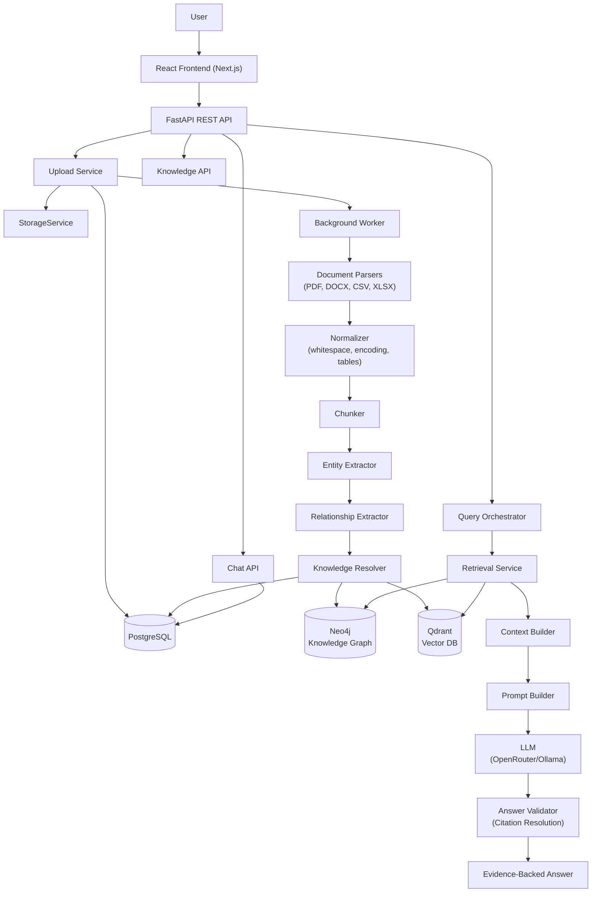
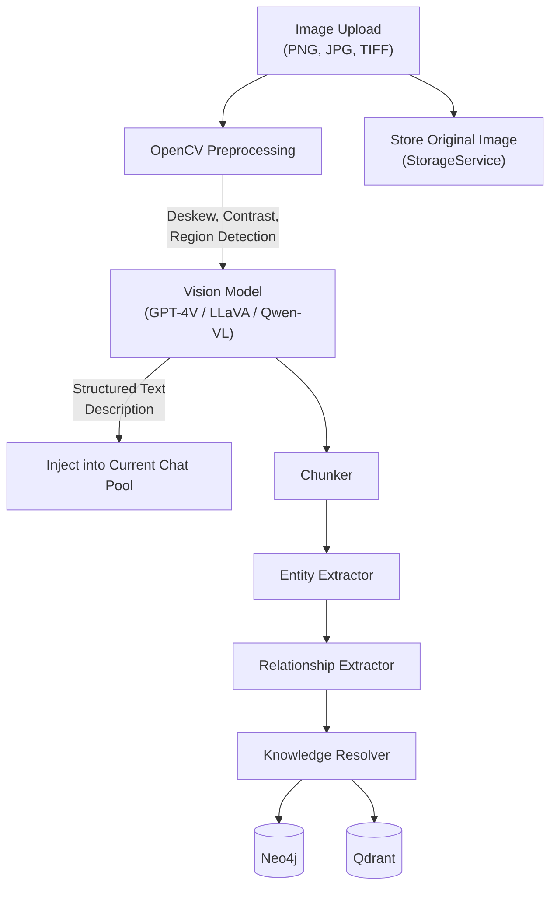
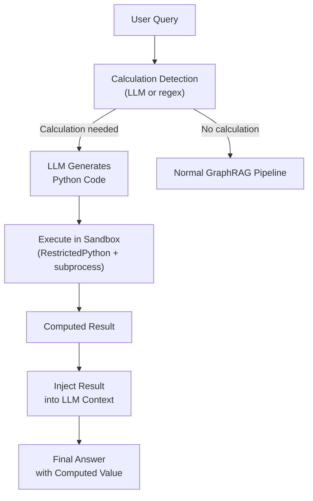
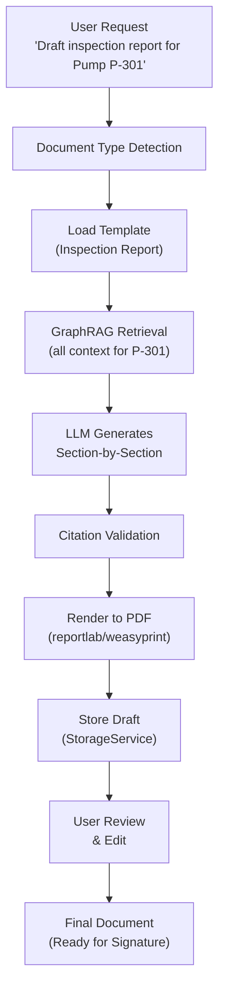
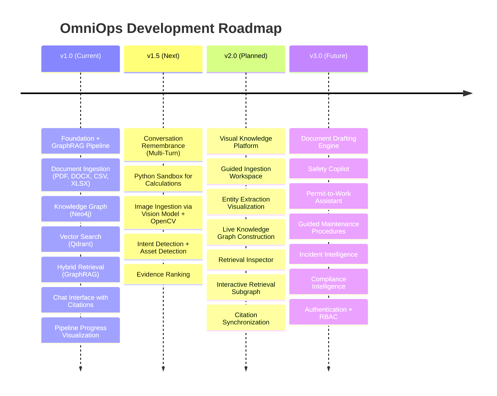

# OmniOps v1.0 — State of the Project

**Version:** 1.0.0
**Date:** October 2026
**Status:** MVP Complete — Knowledge Engine, GraphRAG, and Chat Interface Operational

---

## 1. Executive Summary

OmniOps is an **Industrial Intelligence Platform** that transforms heterogeneous industrial documents (manuals, inspection reports, maintenance logs, SOPs, work orders) into a continuously evolving organizational memory. It is **NOT** a chatbot — the chatbot is only one interface. The real product is the **knowledge layer**.

### What Makes OmniOps Different

Unlike general-purpose RAG applications (e.g., AnythingLLM, PrivateGPT), OmniOps implements a **domain-specific knowledge pipeline** that:

1. **Extracts industrial entities** — pumps, valves, bearings, work orders, engineers, locations, regulations
2. **Builds a Knowledge Graph** (Neo4j) — explicit relationships like `Pump HAS_COMPONENT Bearing`, `Engineer INSPECTED Pump`
3. **Performs Hybrid Retrieval (GraphRAG)** — combines vector similarity (Qdrant) with graph traversal (Neo4j) for structurally-aware answers
4. **Validates every answer with citations** — deterministic citation resolution ensures no hallucinated industrial facts
5. **Preserves organizational memory** — every uploaded document enriches the knowledge base permanently

### Technology Stack

| Concern | Technology | Purpose |
|---------|-----------|---------|
| Backend API | FastAPI (Python) | HTTP API and service orchestration |
| Knowledge Graph | Neo4j 5.22 | Explicit industrial relationships and graph traversal |
| Vector Database | Qdrant 1.10 | Semantic retrieval via embeddings |
| Relational Database | PostgreSQL 16 | Documents, jobs, chat sessions, audit metadata |
| Background Queue | Redis 7 + RQ | Asynchronous ingestion job execution |
| LLM | OpenRouter / Ollama | Reasoning over retrieved context only |
| Embeddings | SentenceTransformers (`all-MiniLM-L6-v2`) | Chunk embedding for semantic search |
| Frontend | Next.js + React + Framer Motion | Industrial-grade web UI |
| File Storage | StorageService abstraction (local / S3 / Azure Blob) | Original document persistence |
| Containerization | Docker Compose (7 services) | Local development and deployment |

### Quick Start

```bash
# Clone and start all services
git clone <repo-url>
cd OmniOps
docker compose up --build

# Services available at:
# Frontend:   http://localhost:3000
# Backend:    http://localhost:8000
# Neo4j:      http://localhost:7474
# Qdrant:     http://localhost:6333
```

For local development without Docker, see Section 8 (Environment & Configuration).

---

## 2. Architecture Overview

### High-Level System Diagram



### Three Core Engines

| Engine | Responsibility | Never Does |
|--------|---------------|------------|
| **Knowledge Engine** | Converts documents → structured knowledge (entities, relationships, embeddings) | Never answers questions |
| **Retrieval Engine** | Assembles evidence-backed context from Neo4j + Qdrant + PostgreSQL | Never parses documents or writes to databases |
| **Intelligence Engine** | Reasons over retrieved context via LLM to produce answers with citations | Never directly accesses databases |

### Data Flow Invariant

```
Document → Parse → Normalize → Chunk → Extract Entities → Extract Relationships
→ Resolve Knowledge → Persist to Neo4j + Qdrant + PostgreSQL
→ User Query → Hybrid Retrieval (Vector + Graph) → Context Assembly
→ Prompt Build → LLM Reasoning → Citation Validation → Evidence-Backed Answer
```

The LLM is **NOT** the source of truth. Truth comes from: Knowledge Graph, Vector Retrieval, Metadata, and Source Documents. The LLM only reasons over retrieved evidence.

---

## 3. Repository Structure

```
OmniOps/
├── backend/                          # Python FastAPI backend
│   ├── main.py                       # App entrypoint with lifespan, CORS, route registration
│   ├── dependencies.py               # Dependency injection (query orchestrator, ingestion orchestrator)
│   ├── worker.py                     # RQ worker entrypoint
│   ├── api/
│   │   └── routes/
│   │       ├── health.py             # /health — connectivity probe for all 4 databases
│   │       ├── documents.py          # /documents — CRUD, status polling, SSE progress, content streaming
│   │       ├── uploads.py            # /uploads — file upload → storage → job enqueue
│   │       ├── query.py              # /query — sync + SSE streaming query with chat persistence
│   │       ├── knowledge.py          # /knowledge — statistics, graph fetch, system status
│   │       ├── chat.py               # /chat — session CRUD, message history
│   │       └── jobs.py               # /jobs — ingestion job status
│   ├── config/
│   │   └── settings.py               # Pydantic Settings for all services (FastAPI, Redis, Postgres, Neo4j, Qdrant, OpenRouter, Storage, Embedding)
│   ├── database/
│   │   ├── repositories.py           # MetadataRepository — documents table, ingestion_jobs table, ingestion_job_events table
│   │   └── chat_repository.py        # ChatRepository — chat_sessions table, chat_messages table
│   ├── parser/
│   │   ├── pdf_parser.py             # PyMuPDF-based PDF text extraction
│   │   ├── docx_parser.py            # python-docx heading/paragraph/table extraction
│   │   ├── csv_parser.py             # CSV to structured records
│   │   └── excel_parser.py           # openpyxl XLSX parsing
│   ├── ingestion/
│   │   ├── models.py                 # DocumentContent dataclass
│   │   ├── metadata.py               # Metadata extraction (hash, page count, file type)
│   │   ├── normalizer.py             # Whitespace cleaning, encoding normalization, table/image extraction, page segmentation
│   │   ├── chunker.py                # Intelligent semantic chunking with heading preservation
│   │   ├── chunk_models.py           # Chunk and ChunkCollection dataclasses
│   │   ├── extractor.py              # Entity extraction (equipment, components, people, locations, dates, etc.)
│   │   ├── entity_models.py          # EntityOccurrence and EntityOccurrenceCollection
│   │   ├── relationship_extractor.py # Relationship extraction (HAS_COMPONENT, CONNECTED_TO, etc.)
│   │   ├── relationship_models.py    # RelationshipOccurrence and RelationshipOccurrenceCollection
│   │   ├── resolver.py               # Knowledge resolution (dedup, alias, confidence, provenance)
│   │   ├── resolution_models.py      # ResolvedEntity, ResolvedRelationship, ResolvedKnowledgePackage
│   │   └── orchestrator.py           # IngestionOrchestrator — 9-stage pipeline with SSE event bus
│   ├── graph/
│   │   ├── repository.py             # GraphRepository abstract interface
│   │   ├── neo4j_connection.py       # Neo4j driver connection manager
│   │   ├── neo4j_repository.py       # Concrete Neo4j implementation (MERGE semantics, full-text search, subgraph expansion)
│   │   └── query_service.py          # GraphQueryService wrapping repository for retrieval
│   ├── vector/
│   │   ├── repository.py             # VectorRepository abstract interface + SearchResult
│   │   ├── embedding_provider.py     # SentenceTransformerEmbeddingProvider (GPU-accelerated)
│   │   ├── qdrant_connection.py      # Qdrant client connection manager
│   │   └── qdrant_repository.py      # Concrete Qdrant implementation (deterministic UUIDs, idempotent upsert)
│   ├── retrieval/
│   │   ├── retrieval_models.py       # RetrievalContext, RetrievedChunk, RetrievedEntity, RetrievedRelationship
│   │   └── service.py                # RetrievalService — parallel vector + graph retrieval with dedup
│   ├── generation/
│   │   ├── llm_provider.py           # LLMProvider abstract interface
│   │   ├── openrouter_provider.py    # OpenRouter HTTP client with retry logic (tenacity)
│   │   ├── ollama_provider.py        # Ollama local LLM provider
│   │   ├── prompt_builder.py         # PromptBuilder — Context #N masking, graph context formatting
│   │   ├── validator.py              # AnswerValidator — deterministic [Context #N] citation resolution
│   │   ├── generation_models.py      # PromptPackage, Citation, GeneratedAnswer, RawGeneration, GenerationResult
│   │   └── service.py                # GenerationService — PromptBuilder → LLM → Validator pipeline
│   ├── query/
│   │   └── orchestrator.py           # QueryOrchestrator — end-to-end retrieval → generation with SSE events
│   ├── services/
│   │   ├── upload_service.py         # Upload flow: validate → store → persist metadata → create job → enqueue
│   │   └── queue_service.py          # RQ queue job enqueue wrapper
│   ├── storage/
│   │   ├── models.py                 # StoredObject dataclass
│   │   ├── service.py                # StorageService abstract interface
│   │   ├── local_storage.py          # Local filesystem implementation
│   │   ├── s3_storage.py             # AWS S3 implementation (stub)
│   │   ├── azure_blob_storage.py     # Azure Blob implementation (stub)
│   │   └── factory.py                # StorageService factory
│   ├── utils/
│   │   └── event_bus.py              # In-process async EventBus for SSE streaming
│   ├── agents/                       # Empty — reserved for future AI agent system
│   ├── workers/                      # Empty — reserved for specialized worker processes
│   ├── models/                       # Reserved for shared data models
│   ├── Dockerfile                    # Python backend container
│   └── requirements.txt              # Python dependencies
├── frontend/                         # Next.js React frontend
│   ├── src/
│   │   ├── app/
│   │   │   ├── layout.tsx            # Root layout with fonts
│   │   │   ├── page.tsx              # Main unified page (all state management, query execution)
│   │   │   └── globals.css           # CSS variables, dark theme, design system
│   │   ├── components/
│   │   │   ├── NavRail.tsx           # Left navigation rail (Overview, Chat, Knowledge Base, Ingestion)
│   │   │   ├── ChatView.tsx          # Three-column chat: sessions | thread | citations
│   │   │   ├── RetrievalStepper.tsx  # Animated pipeline stage visualization
│   │   │   ├── RetrievalGraph.tsx    # Interactive force-directed knowledge graph (react-force-graph-2d)
│   │   │   ├── IngestionView.tsx     # Document upload trigger
│   │   │   ├── IngestionWorkspace.tsx # Stage-by-stage ingestion progress with entity/relationship display
│   │   │   ├── KnowledgeBaseView.tsx # Document list with status, delete, view actions
│   │   │   ├── OverviewView.tsx      # Overview placeholder
│   │   │   ├── SystemStatusPanel.tsx # LLM-generated operational status summary
│   │   │   └── AnimatedCounter.tsx   # Smooth number animation component
│   │   └── services/
│   │       └── api.ts                # Singleton API client (fetch-based, SSE streaming support)
│   ├── package.json                  # Next.js 15 + framer-motion + lucide-react + react-force-graph-2d
│   └── tsconfig.json
├── docs/                             # Architecture specifications
│   ├── 00_TASK_MASTER.md             # Development task roadmap (all MVP tasks completed)
│   ├── 01_CONTEXT.md                 # Product vision, philosophy, constraints
│   ├── 02_SYSTEM_ARCHITECTURE.md     # Full system architecture specification
│   ├── 03_GRAPH_SCHEMA.md            # Neo4j ontology (node types, relationships, evidence model)
│   ├── 04_INGESTION_PIPELINE.md      # 11-stage ingestion pipeline specification
│   ├── 05_RETRIEVAL_ENGINE.md        # Retrieval pipeline specification
│   └── 06_VERSION_2_DESC.md          # Version 2 visual knowledge platform vision
├── docker-compose.yml                # 7-service Docker stack
├── render.yaml                       # Render.com deployment config
├── DEPLOYMENT.md                     # Deployment instructions
├── AGENTS.md                         # AI coding agent rules
└── tests/                            # Empty — reserved for automated tests
```

---

## 4. Implemented Features — Truthful Audit

Every feature below has been verified against the actual source code. Status indicators:
- ✅ **Working** — Code exists, wired up, and functional
- 🟡 **Partial** — Code exists but missing components or has known limitations
- ❌ **Missing** — Not implemented at all

---

### 4.1 Document Ingestion Pipeline

The ingestion pipeline is the **most complete subsystem** in OmniOps. Every uploaded document passes through a deterministic 9-stage pipeline orchestrated by `IngestionOrchestrator`.

| Stage | Component | File | Status |
|-------|-----------|------|--------|
| 1. Upload | Validate, store, create metadata, create job, enqueue | `services/upload_service.py` | ✅ Working |
| 2. Parse | Route to correct parser by extension | `dependencies.py` → `parser/*.py` | ✅ Working |
| 3. Metadata | Extract document_id, hash, page_count, timestamps | `ingestion/metadata.py` | ✅ Working |
| 4. Normalize | Clean whitespace, normalize encoding, extract tables/images, segment pages | `ingestion/normalizer.py` | ✅ Working |
| 5. Chunk | Semantic chunking with heading preservation and overlap | `ingestion/chunker.py` | ✅ Working |
| 6. Entity Extraction | Equipment, components, people, locations, dates, maintenance intervals, failure types, regulations, work orders | `ingestion/extractor.py` | ✅ Working |
| 7. Relationship Extraction | HAS_COMPONENT, CONNECTED_TO, MAINTAINED_BY, LOCATED_IN, INSPECTED_BY, CAUSES, REFERENCES, SIMILAR_TO | `ingestion/relationship_extractor.py` | ✅ Working |
| 8. Knowledge Resolution | Duplicate detection, alias resolution, canonical entity selection, confidence scoring, provenance preservation | `ingestion/resolver.py` | ✅ Working |
| 9. Graph + Vector Persistence | MERGE entities/relationships to Neo4j, upsert embeddings to Qdrant | `graph/neo4j_repository.py`, `vector/qdrant_repository.py` | ✅ Working |

**Supported File Types:**

| Format | Parser | Library | Status |
|--------|--------|---------|--------|
| Machine-readable PDF | `parse_pdf()` | PyMuPDF | ✅ Working |
| DOCX | `parse_docx()` | python-docx | ✅ Working |
| CSV | `parse_csv()` | Python csv module | ✅ Working |
| XLSX/XLS | `parse_excel()` | openpyxl | ✅ Working |
| Scanned PDF (OCR) | — | — | ❌ Missing |
| Images (PNG/JPG) | — | — | ❌ Missing |
| P&ID Drawings | — | — | ❌ Missing |
| TXT / Email | — | — | ❌ Missing |

**Pipeline Progress Streaming:**

The ingestion pipeline emits real-time SSE events via the in-process `EventBus`. Each stage transition is published to the topic `pipeline_{document_id}` with a progress percentage (5% → 15% → 25% → ... → 100%). The frontend `IngestionWorkspace` component consumes these events and renders an animated stage-by-stage visualization.

---

### 4.2 Knowledge Graph (Neo4j)

| Feature | File | Status |
|---------|------|--------|
| Connection manager with driver lifecycle | `graph/neo4j_connection.py` | ✅ Working |
| Entity persistence with MERGE semantics (idempotent) | `graph/neo4j_repository.py` | ✅ Working |
| Relationship persistence with MERGE semantics | `graph/neo4j_repository.py` | ✅ Working |
| Controlled vocabulary: 9 node labels (Asset, Component, Person, Location, Date, Parameter, FailureType, Regulation, Event) | `graph/neo4j_repository.py` | ✅ Working |
| Controlled vocabulary: 8 relationship types | `graph/neo4j_repository.py` | ✅ Working |
| Full-text search index (`entity_names`) with Lucene fuzzy matching | `graph/neo4j_repository.py` | ✅ Working |
| Neighbor traversal with direction + type filters | `graph/neo4j_repository.py` | ✅ Working |
| Multi-hop traversal (clamped 1–10 depth) | `graph/neo4j_repository.py` | ✅ Working |
| Subgraph expansion (center + nodes + edges) | `graph/neo4j_repository.py` | ✅ Working |
| Full graph fetch for visualization (with limit) | `graph/neo4j_repository.py` | ✅ Working |
| Document deletion cascade (relationships → nodes → Document node) | `graph/neo4j_repository.py` | ✅ Working |

**Neo4j Node Properties (per entity):**
- `entity_id` (deterministic hash)
- `canonical_name`
- `entity_type`
- `confidence`
- `document_id`
- `occurrences` (list of chunk references)
- `updated_at`
- Type-specific properties from extraction

**Neo4j Relationship Properties:**
- `relationship_id`
- `confidence`
- `document_id`
- `occurrences`
- `updated_at`

---

### 4.3 Vector Database (Qdrant)

| Feature | File | Status |
|---------|------|--------|
| Embedding generation (SentenceTransformers) | `vector/embedding_provider.py` | ✅ Working |
| GPU-accelerated embedding with automatic device detection | `vector/embedding_provider.py` | ✅ Working |
| Collection auto-creation with COSINE distance | `vector/qdrant_repository.py` | ✅ Working |
| Payload index on `document_id` for fast filtering | `vector/qdrant_repository.py` | ✅ Working |
| Deterministic UUID generation from `chunk_id` (idempotent upserts) | `vector/qdrant_repository.py` | ✅ Working |
| Semantic search with optional `document_id` filter | `vector/qdrant_repository.py` | ✅ Working |
| Document deletion by `document_id` filter | `vector/qdrant_repository.py` | ✅ Working |

**Embedding Model:** `all-MiniLM-L6-v2` (384-dimensional, fast, good for short to medium chunks)

**Collection:** `omniops_chunks`

**Chunk Payload Fields:** `chunk_id`, `document_id`, `chunk_index`, `page_index`, `section`, `text`, plus arbitrary metadata

---

### 4.4 Hybrid Retrieval (GraphRAG)

This is the core differentiator. The `RetrievalService` performs **parallel** vector and graph retrieval using `ThreadPoolExecutor`, then merges the results into a single `RetrievalContext`.

| Feature | File | Status |
|---------|------|--------|
| Parallel vector + graph retrieval (ThreadPoolExecutor) | `retrieval/service.py` | ✅ Working |
| Vector retrieval: embed query → Qdrant top-k search → deduplicate | `retrieval/service.py` | ✅ Working |
| Graph retrieval: keyword search on Neo4j full-text index | `retrieval/service.py` | ✅ Working |
| Subgraph expansion from each discovered entity (depth=1) | `retrieval/service.py` | ✅ Working |
| Connected entity discovery during expansion | `retrieval/service.py` | ✅ Working |
| Relationship collection from subgraphs | `retrieval/service.py` | ✅ Working |
| Deduplication by `chunk_id` and `entity_id` | `retrieval/service.py` | ✅ Working |
| Graceful fallback on vector or graph failure | `retrieval/service.py` | ✅ Working |

**What The LLM Receives:**
1. **Chunks** — Semantically relevant text passages from Qdrant with page numbers and sections
2. **Entities** — Industrial entities from Neo4j (e.g., "Pump P-301 (Asset)", "Bearing B12 (Component)")
3. **Relationships** — Structural connections (e.g., "Pump P-301 → HAS_COMPONENT → Bearing B12")

**What Is NOT Implemented:**

| Feature | Architecture Spec | Status |
|---------|------------------|--------|
| Intent Detection (maintenance, compliance, troubleshooting, etc.) | `05_RETRIEVAL_ENGINE.md` Stage 1 | ❌ Not implemented |
| Asset Detection (extract referenced entity IDs from query) | `05_RETRIEVAL_ENGINE.md` Stage 2 | ❌ Not implemented |
| Metadata/Readiness Filtering (date, plant, department filters) | `05_RETRIEVAL_ENGINE.md` Stage 3 | ❌ Not implemented |
| Evidence Ranking (semantic similarity, graph distance, recency, authority) | `05_RETRIEVAL_ENGINE.md` Stage 6 | ❌ Not implemented |

Currently, retrieval does raw keyword search and returns results without intelligent routing or ranking.

---

### 4.5 LLM Generation

| Feature | File | Status |
|---------|------|--------|
| OpenRouter HTTP provider with retry (exponential backoff, 4 attempts) | `generation/openrouter_provider.py` | ✅ Working |
| Ollama local provider (REST API `/api/generate`) | `generation/ollama_provider.py` | ✅ Working |
| Prompt builder with Context #N masking (never exposes UUIDs to LLM) | `generation/prompt_builder.py` | ✅ Working |
| Graph context formatting (entities + relationships as text) | `generation/prompt_builder.py` | ✅ Working |
| Deterministic citation validator (regex `[Context #N]` resolution) | `generation/validator.py` | ✅ Working |
| Hallucinated citation filtering (silently drops invalid references) | `generation/validator.py` | ✅ Working |
| Error classification: AuthenticationError, RateLimitError, ServerError | `generation/openrouter_provider.py` | ✅ Working |
| Immutable data contracts (PromptPackage, Citation, GeneratedAnswer, RawGeneration) | `generation/generation_models.py` | ✅ Working |

**System Prompt:**
```
You are a helpful industrial intelligence assistant. Use the provided context to answer
the user's query. If the user's query is just a topic or name (like a pump name),
summarize all the information you have about it from the context. If you truly cannot
find any relevant information in the context, say 'I do not know'. Always cite your
sources using the format [Context #N] at the end of the sentence.
```

**Supported LLM Providers:**

| Provider | Configuration | Notes |
|----------|--------------|-------|
| OpenRouter | `OPENROUTER_BASE_URL`, `OPENROUTER_API_KEY`, `OPENROUTER_MODEL` | Production — supports any model via OpenRouter |
| Ollama (local) | Pointed at via OpenRouter config (`http://host.docker.internal:11434/v1`) | Development — uses Ollama's OpenAI-compatible endpoint |

---

### 4.6 API Layer

All routes are implemented with FastAPI. CORS is fully open (`allow_origins=["*"]`) for development.

| Endpoint | Method | Description | File | Status |
|----------|--------|-------------|------|--------|
| `/health` | GET | Connectivity probe for Postgres, Neo4j, Redis, Qdrant with latency | `api/routes/health.py` | ✅ Working |
| `/uploads` | POST | Upload file → validate → store → create job → enqueue processing | `api/routes/uploads.py` | ✅ Working |
| `/documents` | GET | List all documents with latest job status | `api/routes/documents.py` | ✅ Working |
| `/documents/{id}/status` | GET | Poll ingestion job status | `api/routes/documents.py` | ✅ Working |
| `/documents/{id}/stream` | GET | SSE stream of ingestion pipeline progress | `api/routes/documents.py` | ✅ Working |
| `/documents/{id}/content` | GET | Stream raw document file (PDF viewer, etc.) | `api/routes/documents.py` | ✅ Working |
| `/documents/{id}` | DELETE | Delete document from Postgres + Neo4j + Qdrant + Storage | `api/routes/documents.py` | ✅ Working |
| `/query` | POST | Synchronous query → retrieval → generation → citations | `api/routes/query.py` | ✅ Working |
| `/query/stream` | POST | SSE streaming query with stage-by-stage events | `api/routes/query.py` | ✅ Working |
| `/knowledge/statistics` | GET | Aggregated counts (documents, chunks, entities, relationships, graph nodes/edges) | `api/routes/knowledge.py` | ✅ Working |
| `/knowledge/graph` | GET | Full knowledge graph (nodes + edges) for visualization | `api/routes/knowledge.py` | ✅ Working |
| `/knowledge/status` | GET | LLM-generated operational safety summary | `api/routes/knowledge.py` | ✅ Working |
| `/chat/sessions` | GET | List all chat sessions | `api/routes/chat.py` | ✅ Working |
| `/chat/sessions` | POST | Create new chat session | `api/routes/chat.py` | ✅ Working |
| `/chat/sessions/{id}` | GET | Get all messages for a session | `api/routes/chat.py` | ✅ Working |
| `/chat/sessions/{id}` | DELETE | Delete session and all messages (CASCADE) | `api/routes/chat.py` | ✅ Working |

**SSE Event Stages (Query):**
```
SESSION_INFO → GENERATING_EMBEDDING → SEARCHING_VECTOR_DB → EXPANDING_KNOWLEDGE_GRAPH
→ RETRIEVED_CONTEXT → BUILDING_PROMPT → GENERATING_RESPONSE → VALIDATING_CITATIONS → COMPLETED
```

**SSE Event Stages (Ingestion):**
```
JOB_CREATED → PARSED → METADATA_EXTRACTED → NORMALIZED → CHUNKED → ENTITY_EXTRACTED
→ RELATIONSHIP_EXTRACTED → KNOWLEDGE_RESOLVED → GRAPH_PERSISTED → VECTOR_PERSISTED → COMPLETED
```

---

### 4.7 Frontend (Next.js + React)

The frontend is a single-page application with four views accessible via a navigation rail.

| Component | File | Description | Status |
|-----------|------|-------------|--------|
| `NavRail` | `components/NavRail.tsx` | 4-view navigation: Overview, Chat, Knowledge Base, Ingestion | ✅ Working |
| `ChatView` | `components/ChatView.tsx` | Three-column layout: session history, active thread, citation panel | ✅ Working |
| `RetrievalStepper` | `components/RetrievalStepper.tsx` | Animated pipeline stage indicator (8 stages with icons) | ✅ Working |
| `RetrievalGraph` | `components/RetrievalGraph.tsx` | Interactive force-directed graph (react-force-graph-2d) with zoom/pan/click | ✅ Working |
| `IngestionWorkspace` | `components/IngestionWorkspace.tsx` | Upload + stage-by-stage progress with entity/relationship display | ✅ Working |
| `KnowledgeBaseView` | `components/KnowledgeBaseView.tsx` | Document list with status badges, delete, view actions | ✅ Working |
| `SystemStatusPanel` | `components/SystemStatusPanel.tsx` | LLM-generated operational safety summary | ✅ Working |
| `AnimatedCounter` | `components/AnimatedCounter.tsx` | Smooth number animation for statistics | ✅ Working |
| `OverviewView` | `components/OverviewView.tsx` | Placeholder overview | 🟡 Stub |
| `ApiClient` | `services/api.ts` | Singleton API client with SSE streaming support | ✅ Working |

**UI Features:**
- Dark industrial theme with CSS custom properties
- Framer Motion animations throughout
- SSE-powered real-time pipeline progress
- Interactive knowledge graph visualization
- Citation highlighting with bidirectional hover
- Chat session management (create, load, delete)
- Document viewer (PDF inline, download for others)
- Responsive layout with fixed navigation rail

---

### 4.8 Infrastructure

| Component | Configuration | Status |
|-----------|--------------|--------|
| Docker Compose with 7 services (api, worker, postgres, neo4j, redis, qdrant, frontend) | `docker-compose.yml` | ✅ Working |
| GPU passthrough for embedding model (NVIDIA) | `docker-compose.yml` | ✅ Configured |
| Shared volume for document storage | `docker-compose.yml` | ✅ Working |
| Render.yaml for cloud deployment | `render.yaml` | ✅ Exists |
| PostgreSQL 16 with health checks | `docker-compose.yml` | ✅ Working |
| Redis 7 with health checks | `docker-compose.yml` | ✅ Working |
| Neo4j 5.22 Community | `docker-compose.yml` | ✅ Working |
| Qdrant 1.10.1 | `docker-compose.yml` | ✅ Working |
| StorageService abstraction with local + S3 + Azure Blob backends | `storage/` | 🟡 Local working, S3/Azure stubs |

---

### 4.9 Chat History & Session Management

| Feature | File | Status |
|---------|------|--------|
| PostgreSQL tables: `chat_sessions`, `chat_messages` | `database/chat_repository.py` | ✅ Working |
| Session CRUD (create, list, get messages, delete with CASCADE) | `database/chat_repository.py` | ✅ Working |
| Auto-title from first user message (first 5 words) | `database/chat_repository.py` | ✅ Working |
| Message persistence with role, content, citations, timestamps | `database/chat_repository.py` | ✅ Working |
| Session auto-creation on streaming query (if no session_id provided) | `api/routes/query.py` | ✅ Working |
| User message saved before query execution | `api/routes/query.py` | ✅ Working |
| Assistant message saved after COMPLETED event | `api/routes/query.py` | ✅ Working |
| Frontend session list with load/delete | `components/ChatView.tsx` | ✅ Working |

---

## 5. Missing / Incomplete Features — Truthful Gaps

---

### 5.1 🔴 CRITICAL: Conversation Remembrance (Multi-Turn Context)

**Current State:** Each query is completely independent. The LLM has **zero memory** of previous turns in a conversation.

**What IS Implemented:**
- Chat sessions and messages are fully persisted in PostgreSQL
- The frontend loads and displays historical messages when a session is selected
- The `session_id` is passed through to the streaming query endpoint

**What Is NOT Implemented:**
- `QueryOrchestrator.answer_query()` does NOT retrieve previous messages from the `ChatRepository`
- The `PromptBuilder.build()` does NOT include conversation history in the prompt
- Each query produces an independent prompt with NO prior context

**Impact:** A user asking "Tell me about Pump P-301" followed by "What maintenance does it need?" will fail on the second question because the LLM doesn't know what "it" refers to.

**Proposed Fix:**

```python
# In QueryOrchestrator.answer_query():
# 1. Retrieve last N messages from ChatRepository
# 2. Format as conversation history
# 3. Pass to PromptBuilder as additional context

chat_repo = ChatRepository()
history = chat_repo.get_messages(session_id)[-10:]  # Last 10 messages

# In PromptBuilder.build():
# Add conversation history section before the user question
history_block = "\n".join([f"{m.role}: {m.content}" for m in history])
# Include in the prompt package
```

**Estimated Effort:** 2-4 hours. The infrastructure is already built; only the wiring is missing.

---

### 5.2 🔴 Image Ingestion via Vision Model + OpenCV

**Current State:** Not implemented. No code exists. Architecture docs list it as "Future".

**Problem:** Industrial documents frequently contain:
- Equipment photographs
- P&ID (Piping and Instrumentation Diagrams)
- Inspection photos with annotations
- Technical drawings with labels

These contain critical knowledge that text-only parsers cannot extract.

**Proposed Architecture:**



**Pipeline Steps:**

1. **Accept image upload** — Extend `ALLOWED_EXTENSIONS` in `upload_service.py` to include `.png`, `.jpg`, `.jpeg`, `.tiff`, `.bmp`

2. **OpenCV Preprocessing** (new module: `parser/image_parser.py`)
   - Deskew correction (Hough transform)
   - Contrast enhancement (CLAHE)
   - Region of interest detection (contour detection)
   - For P&IDs: symbol detection using template matching

3. **Vision Model Feature Extraction** (new module: `parser/vision_extractor.py`)
   - Send preprocessed image to a Vision LLM (GPT-4V via OpenRouter, or local LLaVA/Qwen-VL via Ollama)
   - Prompt: "Describe all equipment, components, labels, annotations, and connections visible in this industrial image"
   - Output: structured text description with entities and relationships

4. **Dual Storage Path:**
   - **Immediate:** Inject extracted text into the current chat pool (so the user gets instant feedback)
   - **Permanent:** Feed the text through the existing chunking → entity extraction → relationship extraction → graph/vector persistence pipeline

5. **Store original image** via existing `StorageService` abstraction

**Required Dependencies:** `opencv-python`, Vision LLM provider configuration

**Estimated Effort:** 2-3 days for MVP (basic image → text → knowledge pipeline)

---

### 5.3 🔴 Python Sandbox for Deterministic Calculations

**Current State:** Not implemented. Not mentioned in any spec. The LLM currently guesses numerical answers.

**Problem:** Industrial queries often involve calculations:
- "What is the pressure drop across Valve V-12 if flow rate increases by 20%?"
- "Calculate the remaining bearing life at current vibration levels"
- "Convert 350°F to Celsius"

The LLM may produce incorrect numerical answers because it's a language model, not a calculator.

**Proposed Architecture:**



**Implementation Plan:**

1. **Calculation Detection** (in `query/orchestrator.py`)
   - After retrieval, before generation, check if the query involves numerical reasoning
   - Use a lightweight LLM prompt: "Does this question require numerical calculation? Reply YES or NO."

2. **Code Generation** (new module: `agents/python_sandbox.py`)
   - If calculation is needed, ask LLM to generate Python code
   - Provide retrieved context as variables
   - Template: "Write a Python script that calculates the answer. Use only math, numpy, or pandas."

3. **Sandboxed Execution**
   - Use `RestrictedPython` for safe execution
   - Alternative: `subprocess` with timeout (5 seconds) and no network/filesystem access
   - Whitelist: `math`, `numpy`, `pandas`, `statistics`, `decimal`
   - Blacklist: `os`, `sys`, `subprocess`, `socket`, `requests`, all I/O

4. **Result Injection**
   - Inject the computed result as additional context: "Computed Result: 176.67°C"
   - LLM incorporates the deterministic value into its answer

**Security Considerations:**
- No filesystem access from sandbox
- No network access
- 5-second execution timeout
- Memory limit (100MB)
- Only whitelisted modules

**Estimated Effort:** 3-4 days

---

### 5.4 🔴 Document Drafting Engine

**Current State:** Not implemented. Not in any spec.

**Problem:** Industrial operations require formal documents that must be:
- Structured according to industry templates
- Evidence-backed with citations
- Ready for review and sign-off
- Traceable to source documents

**Proposed Architecture:**



**Supported Document Types (Proposed):**

| Document Type | Template Sections |
|---------------|-------------------|
| Inspection Report | Header, Equipment ID, Inspection Date, Findings, Observations, Recommendations, Inspector Signature |
| Maintenance Work Order | Work Order #, Asset, Description, Parts Required, Procedure, Safety Notes, Approval |
| Compliance Certificate | Regulation Reference, Asset, Compliance Status, Evidence, Inspector, Date |
| Incident Report | Incident ID, Date, Location, Description, Root Cause, Corrective Actions, Sign-off |
| Shift Handover | Shift Details, Equipment Status, Pending Issues, Safety Alerts, Handover Notes |
| Risk Assessment | Hazard, Likelihood, Severity, Risk Level, Controls, Residual Risk |

**Implementation Plan:**

1. **Template Engine** (new module: `generation/document_templates/`)
   - YAML or JSON template definitions for each document type
   - Each template defines required sections and their prompts

2. **Section-by-Section Generation**
   - For each section in the template, run a targeted GraphRAG query
   - Assemble sections with citations

3. **PDF Rendering** (using `weasyprint` or `reportlab`)
   - Professional formatting with company header/footer
   - Signature blocks
   - Citation appendix

4. **Draft Management** (new tables in PostgreSQL)
   - Store drafts as JSON with rendered PDF
   - Version tracking
   - Approval workflow (future)

**Estimated Effort:** 5-7 days for MVP (single document type with PDF generation)

---

### 5.5 🟡 Authentication & RBAC

**Current State:** Explicitly excluded from MVP per architecture docs (`02_SYSTEM_ARCHITECTURE.md` line 631).

**What Exists:**
- Route boundaries are auth-ready (all routes accept request context)
- Data access patterns are easy to scope later
- No user table, no sessions, no middleware

**Impact:** Single-user only. Anyone with network access can use the platform.

---

### 5.6 🟡 Connection Pool Management

**Current State:** TODOs in `main.py` (lines 32-35).

```python
# TODO: Instantiate Neo4j, Qdrant, Postgres Connection Managers here
# app.state.neo4j = Neo4jConnectionManager(settings.neo4j)
# app.state.qdrant = QdrantConnectionManager(settings.qdrant)
# app.state.postgres = PostgresConnectionManager(settings.postgres)
```

**Impact:** Every request creates a new database connection. This works for development but is not production-grade. The `dependencies.py` file creates new `Neo4jConnectionManager` and `QdrantConnectionManager` instances per request.

---

### 5.7 🟡 RQ Worker vs BackgroundTasks

**Current State:** The upload service bypasses Redis/RQ entirely and uses FastAPI `BackgroundTasks` directly.

```python
# In upload_service.py:
background_tasks.add_task(
    process_ingestion_job,
    lifecycle_job_id=job_id,
    document_id=document_id,
    file_name=file_name,
)
```

**Why:** RQ does not work natively on Windows (`fork()` is required). The `worker.py` uses `SimpleWorker` on Windows as a workaround, but the upload path bypasses RQ entirely for reliability.

**Impact:** No distributed worker queue. Ingestion runs in-process. Fine for development and single-server deployment. Would need to be re-enabled for multi-worker production deployment.

---

### 5.8 🟡 Automated Tests

**Current State:** `tests/` contains only `.gitkeep`. Backend `tests/` also contains only `.gitkeep`. No unit tests, integration tests, or end-to-end tests exist.

**Impact:** No automated quality gates. All testing is manual.

---

### 5.9 🟡 Intent Detection & Asset Detection

**Current State:** Specified in `05_RETRIEVAL_ENGINE.md` as Stages 1 and 2 of the retrieval pipeline. NOT implemented as separate services.

**What The Spec Says:**
- **Intent Detection:** Classify query intent (Maintenance, Compliance, Asset Lookup, Troubleshooting, Timeline, Root Cause Analysis)
- **Asset Detection:** Extract referenced entity IDs from query text ("Why is Pump P301 vibrating?" → `Pump P301`)

**What Actually Happens:** The `RetrievalService` does raw keyword search against Neo4j's full-text index and Qdrant's vector similarity. No intelligent routing or intent-based prompt selection.

---

### 5.10 🟡 Evidence Ranking

**Current State:** Specified in `05_RETRIEVAL_ENGINE.md` as Stage 6. NOT implemented.

**What The Spec Says:** Rank evidence by semantic similarity, graph distance, document authority, confidence, recency, source priority, provenance completeness.

**What Actually Happens:** Results are returned in the order they come from Qdrant (by cosine similarity score) and Neo4j (by full-text search score). No cross-source ranking or fusion.

---

## 6. Technical Deep-Dive: Document Ingestion Data Flow

**Trace of a PDF upload from HTTP request to queryable knowledge:**

```
1. User selects "maintenance_report.pdf" in frontend
   └── frontend/src/components/IngestionView.tsx → ApiClient.uploadDocument()

2. POST /uploads with multipart form data
   └── api/routes/uploads.py → handle_upload()

3. Upload Service validates, stores, persists metadata, creates job
   └── services/upload_service.py
   ├── _validate_upload() → checks extension (.pdf ∈ ALLOWED_EXTENSIONS)
   ├── document_id = sha256(file_bytes).hexdigest()
   ├── storage_service.put_bytes() → saves to /data/storage/documents/{id}/maintenance_report.pdf
   ├── MetadataRepository.save_document_metadata() → INSERT INTO documents
   ├── MetadataRepository.create_ingestion_job() → INSERT INTO ingestion_jobs (PENDING)
   └── BackgroundTasks.add_task(process_ingestion_job) → runs async

4. Ingestion Orchestrator runs 9-stage pipeline
   └── ingestion/orchestrator.py → IngestionOrchestrator.run_pipeline()

   Stage 1: PARSED
   └── parser/pdf_parser.py → PyMuPDF extracts text, pages, metadata
   → Returns DocumentContent(filename, text, pages, page_count, metadata)

   Stage 2: METADATA_EXTRACTED
   └── ingestion/metadata.py → extract_metadata()
   → Attaches document_id, file_hash, page_count, upload_time, storage_uri, job_id

   Stage 3: NORMALIZED
   └── ingestion/normalizer.py → clean_whitespace → normalize_encoding → extract_tables → extract_images → segment_pages
   → Cleans text, normalizes Unicode, extracts structured tables/images

   Stage 4: CHUNKED
   └── ingestion/chunker.py → chunk_document()
   → Produces ChunkCollection with semantic chunks (heading preservation, overlap)

   Stage 5: ENTITY_EXTRACTED
   └── ingestion/extractor.py → extract_entities()
   → Identifies equipment, components, people, locations, dates, maintenance intervals, failure types, regulations, work orders
   → Returns EntityOccurrenceCollection

   Stage 6: RELATIONSHIP_EXTRACTED
   └── ingestion/relationship_extractor.py → extract_relationships()
   → Identifies HAS_COMPONENT, CONNECTED_TO, MAINTAINED_BY, LOCATED_IN, etc.
   → Returns RelationshipOccurrenceCollection

   Stage 7: KNOWLEDGE_RESOLVED
   └── ingestion/resolver.py → resolve_knowledge()
   → Deduplicates entities by canonical name
   → Assigns deterministic entity_ids (hash-based)
   → Resolves aliases, calculates confidence
   → Returns ResolvedKnowledgePackage

   Stage 8: GRAPH_PERSISTED
   └── graph/neo4j_repository.py → persist_knowledge_package()
   → MERGE entities as typed nodes (Asset, Component, Person, etc.)
   → MERGE relationships between nodes
   → Single atomic transaction

   Stage 9: VECTOR_PERSISTED
   └── vector/embedding_provider.py → generate_embeddings()
   └── vector/qdrant_repository.py → upsert_chunks()
   → Generate embeddings for all chunks
   → Upsert to Qdrant with deterministic UUIDs

   Stage 10: COMPLETED
   └── MetadataRepository.update_job_status("COMPLETED")
   └── EventBus publishes {"stage": "COMPLETED", "progress": 100}
```

---

## 7. Technical Deep-Dive: Query Pipeline Data Flow

**Trace of a user query from input to evidence-backed answer:**

```
1. User types "What maintenance is required for Pump P-301?" in frontend
   └── frontend/src/app/page.tsx → handleQuerySubmit()
   └── ApiClient.queryStream() → POST /query/stream (SSE)

2. Stream endpoint creates/loads session, saves user message
   └── api/routes/query.py → stream_query()
   ├── ChatRepository.create_session() (if no session_id)
   ├── ChatRepository.add_message(role="user")
   └── asyncio.create_task → run_query() in thread pool

3. QueryOrchestrator.answer_query() executes full pipeline
   └── query/orchestrator.py
   ├── Emits SSE: GENERATING_EMBEDDING
   ├── Emits SSE: SEARCHING_VECTOR_DB
   ├── Emits SSE: EXPANDING_KNOWLEDGE_GRAPH

4. RetrievalService.retrieve() — Parallel execution
   └── retrieval/service.py
   ├── Thread 1: _retrieve_vectors()
   │   ├── EmbeddingProvider.generate_embeddings([query])
   │   ├── QdrantVectorRepository.search(query_vector, limit=5)
   │   └── Deduplicate by chunk_id → list[RetrievedChunk]
   │
   └── Thread 2: _retrieve_graph()
       ├── GraphQueryService.search_nodes(query) → full-text index
       ├── For each discovered entity:
       │   └── GraphQueryService.expand_subgraph(entity_id, max_depth=1)
       ├── Collect connected entities + relationships
       └── Deduplicate → list[RetrievedEntity], list[RetrievedRelationship]

5. Emits SSE: RETRIEVED_CONTEXT (with counts)

6. GenerationService.generate_answer(context)
   └── generation/service.py
   ├── PromptBuilder.build(context)
   │   ├── Map chunks to "Context #1", "Context #2", etc.
   │   ├── Format entities: "Entity: Pump P-301 (Asset)"
   │   ├── Format relationships: "Relationship: Pump P-301 → HAS_COMPONENT → Bearing B12"
   │   └── Returns PromptPackage + ContextMapping
   │
   ├── Emits SSE: BUILDING_PROMPT, GENERATING_RESPONSE
   ├── OpenRouterLLMProvider.generate(prompt_package)
   │   ├── Constructs OpenAI Chat Completion payload
   │   ├── POST to OpenRouter/Ollama with retry logic
   │   └── Returns RawGeneration(raw_response, metadata)
   │
   ├── Emits SSE: VALIDATING_CITATIONS
   └── AnswerValidator.validate(raw, context_mapping)
       ├── Regex: find all [Context #N] references
       ├── Map N → RetrievedChunk from ContextMapping
       ├── Create Citation objects (chunk_id, document_id, page_index, source_text)
       ├── Silently drop hallucinated references
       └── Returns GeneratedAnswer(answer_text, citations)

7. Emits SSE: COMPLETED (with full answer + citations + metadata)
   └── ChatRepository.add_message(role="assistant", content=answer, citations=citations)

8. Frontend renders answer with clickable [N] citation references
   └── ChatView renders answer text
   └── Citation panel shows source documents with page numbers and text preview
```

---

## 8. Environment & Configuration

### Environment Variables (Complete Reference)

| Variable | Required | Default | Description |
|----------|----------|---------|-------------|
| `OPENROUTER_API_KEY` | **Yes** | — | API key for OpenRouter (or `ollama-local` for Ollama) |
| `OPENROUTER_MODEL` | **Yes** | — | Model ID (e.g., `llama3.2`, `google/gemini-2.0-flash-001`) |
| `OPENROUTER_BASE_URL` | No | `https://openrouter.ai/api/v1` | Base URL (use `http://localhost:11434/v1` for Ollama) |
| `DATABASE_URL` | **Yes** | — | Full PostgreSQL DSN |
| `NEO4J_URI` | **Yes** | — | Neo4j Bolt URI (e.g., `bolt://localhost:7687`) |
| `NEO4J_USER` | No | `neo4j` | Neo4j username |
| `NEO4J_PASSWORD` | **Yes** | — | Neo4j password |
| `QDRANT_HOST` | No | `qdrant` | Qdrant host |
| `QDRANT_PORT` | No | `6333` | Qdrant port |
| `QDRANT_URL` | No | — | Full Qdrant URL (overrides host:port) |
| `QDRANT_API_KEY` | No | — | Qdrant API key (for cloud) |
| `REDIS_HOST` | No | `redis` | Redis host |
| `REDIS_PORT` | No | `6379` | Redis port |
| `REDIS_URL` | No | — | Full Redis URL (overrides host:port) |
| `STORAGE_BACKEND` | No | `local` | Storage backend (`local`, `s3`, `azure_blob`) |
| `STORAGE_LOCAL_ROOT` | No | `/data/storage` | Local filesystem root for document storage |
| `EMBEDDING_MODEL_NAME` | No | `all-MiniLM-L6-v2` | SentenceTransformers model |
| `FASTAPI_APP_NAME` | No | `OmniOps API` | Application name |
| `FASTAPI_HOST` | No | `0.0.0.0` | API bind host |
| `FASTAPI_PORT` | No | `8000` | API bind port |

### Local Development (Without Docker)

```bash
# 1. Start infrastructure services
docker compose up postgres neo4j redis qdrant -d

# 2. Backend
cd backend
python -m venv .venv
.venv\Scripts\activate  # Windows
pip install -r requirements.txt
uvicorn main:app --reload --port 8000

# 3. Frontend
cd frontend
npm install
npm run dev  # http://localhost:3000

# 4. Worker (optional, for RQ-based ingestion)
cd backend
python worker.py
```

### Docker Deployment

```bash
docker compose up --build
```

All 7 services start: `api`, `worker`, `postgres`, `neo4j`, `redis`, `qdrant`, `frontend`.

---

## 9. Version Roadmap



### v1.5 Priority Features (Immediate Next)

| Feature | Impact | Effort | Priority |
|---------|--------|--------|----------|
| Conversation Remembrance | Critical — enables multi-turn chat | 2-4 hours | P0 |
| Intent Detection | High — enables intelligent routing | 1-2 days | P1 |
| Asset Detection | High — improves retrieval precision | 1-2 days | P1 |
| Evidence Ranking | Medium — improves answer quality | 2-3 days | P2 |
| Python Sandbox | Medium — enables deterministic calculations | 3-4 days | P2 |
| Image Ingestion (Vision) | High — unlocks new document types | 2-3 days | P1 |
| Connection Pooling | Medium — production readiness | 1 day | P2 |
| Automated Tests | High — quality gates | 3-5 days | P1 |

---

## 10. Comparison with AnythingLLM

OmniOps and [AnythingLLM](https://github.com/Mintplex-Labs/anything-llm) solve different problems. AnythingLLM is a general-purpose "chat with your documents" platform. OmniOps is a **domain-specific Industrial Intelligence Platform** with a knowledge graph at its core.

| Feature | AnythingLLM | OmniOps | Notes |
|---------|-------------|---------|-------|
| **Knowledge Graph** | ❌ None | ✅ Neo4j | OmniOps's core differentiator |
| **Hybrid Retrieval (GraphRAG)** | ❌ Vector only | ✅ Vector + Graph | Structural + semantic search |
| **Industrial Entity Extraction** | ❌ | ✅ 9 entity types | Pumps, valves, bearings, regulations, etc. |
| **Relationship Extraction** | ❌ | ✅ 8 relationship types | HAS_COMPONENT, CAUSES, REFERENCES, etc. |
| **Knowledge Resolution** | ❌ | ✅ Dedup, alias, confidence | Canonical entity management |
| **Citation Validation** | 🟡 Basic | ✅ Deterministic regex | Drops hallucinated citations |
| **Document Ingestion** | ✅ Multi-format | ✅ PDF, DOCX, CSV, XLSX | AnythingLLM supports more formats |
| **Vector Database** | ✅ Multiple (LanceDB, Pinecone, Qdrant, etc.) | ✅ Qdrant | AnythingLLM more flexible |
| **Chat History** | ✅ Full multi-turn | 🟡 Persisted but no multi-turn context | OmniOps critical gap |
| **Conversation Memory** | ✅ Automatic + user-managed | ❌ Not implemented | AnythingLLM feature |
| **Multi-User** | ✅ Full RBAC | ❌ Single user | Docker version only for AnythingLLM |
| **AI Agents** | ✅ Custom agents, tool use, browsing | ❌ Not implemented | Major AnythingLLM feature |
| **Python Code Execution** | ✅ Via agent tools | ❌ Not implemented | OmniOps planned for v1.5 |
| **Image/Vision** | ✅ Multi-modal LLMs | ❌ Not implemented | OmniOps planned for v1.5 |
| **Document Drafting** | ❌ | ❌ Planned for v3.0 | OmniOps unique roadmap feature |
| **LLM Providers** | ✅ 30+ providers | ✅ OpenRouter + Ollama | OpenRouter gives access to all models |
| **Embedding Providers** | ✅ Multiple | ✅ SentenceTransformers | OmniOps runs embeddings locally |
| **Pipeline Visualization** | ❌ | ✅ SSE real-time stages | OmniOps shows ingestion + query progress |
| **Graph Visualization** | ❌ | ✅ Interactive force-directed graph | OmniOps unique feature |
| **Domain Specificity** | ❌ General purpose | ✅ Industrial/HSE | OmniOps tailored for industrial operations |
| **Deployment** | ✅ Desktop + Docker + Cloud | ✅ Docker + Render | AnythingLLM more deployment options |

### What OmniOps Does Better
1. **Understands industrial knowledge structure** — not just text, but entities, relationships, timelines
2. **Graph-augmented retrieval** — answers include structural context, not just similar text
3. **Deterministic citation validation** — every answer is traceable to source documents
4. **Pipeline transparency** — users see exactly what happens to their documents

### What AnythingLLM Does Better
1. **Multi-turn conversation** — full conversation memory
2. **Agent ecosystem** — browsing, code execution, tool use
3. **Provider flexibility** — 30+ LLM providers, multiple vector DBs
4. **Multi-user support** — full RBAC and permissioning
5. **Deployment options** — desktop app, Docker, cloud hosting

---

## 11. Database Schema Summary

### PostgreSQL Tables

| Table | Purpose | Key Columns |
|-------|---------|-------------|
| `documents` | Document metadata | `document_id`, `file_name`, `content_type`, `storage_key`, `storage_backend`, `size_bytes`, `checksum`, `created_at` |
| `ingestion_jobs` | Job lifecycle tracking | `job_id`, `document_id`, `status`, `rq_job_id`, `error`, `created_at`, `updated_at` |
| `ingestion_job_events` | Job event audit log | `id`, `job_id`, `status`, `error`, `created_at` |
| `chat_sessions` | Chat session metadata | `session_id`, `title`, `created_at`, `updated_at` |
| `chat_messages` | Chat message history | `message_id`, `session_id`, `role`, `content`, `citations` (JSONB), `created_at` |

### Neo4j Node Labels

| Label | Examples | Key Properties |
|-------|----------|----------------|
| `Asset` | Pump P-301, Boiler B2 | `entity_id`, `canonical_name`, `asset_type`, `manufacturer`, `model`, `status` |
| `Component` | Bearing, Seal, Motor | `entity_id`, `canonical_name`, `specification` |
| `Person` | John Smith (Engineer) | `entity_id`, `canonical_name`, `role` |
| `Location` | Plant A, Area 1 | `entity_id`, `canonical_name` |
| `Date` | 2024-01-15 | `entity_id`, `canonical_name` |
| `Parameter` | Temperature, Pressure | `entity_id`, `canonical_name`, `value`, `unit` |
| `FailureType` | Bearing Failure | `entity_id`, `canonical_name` |
| `Regulation` | ISO 9001, OSHA | `entity_id`, `canonical_name` |
| `Event` | Inspection, Repair | `entity_id`, `canonical_name`, `severity`, `timestamp` |
| `Document` | (source reference) | `document_id`, `updated_at` |

### Neo4j Relationship Types

| Relationship | Meaning | Example |
|-------------|---------|---------|
| `HAS_COMPONENT` | Asset contains component | Pump → HAS_COMPONENT → Bearing |
| `CONNECTED_TO` | Physical connection | Pump → CONNECTED_TO → Valve |
| `MAINTAINED_BY` | Person performed maintenance | Pump → MAINTAINED_BY → Engineer |
| `LOCATED_IN` | Asset location | Pump → LOCATED_IN → Area A |
| `INSPECTED_BY` | Person inspected asset | Pump → INSPECTED_BY → Inspector |
| `CAUSES` | Failure relationship | Vibration → CAUSES → Bearing Failure |
| `REFERENCES` | Document references entity | Manual → REFERENCES → Pump |
| `SIMILAR_TO` | Historical similarity | Failure A → SIMILAR_TO → Failure B |

### Qdrant Collection

| Collection | Vector Dimension | Distance | Payload Fields |
|-----------|-----------------|----------|----------------|
| `omniops_chunks` | 384 (all-MiniLM-L6-v2) | COSINE | `chunk_id`, `document_id`, `chunk_index`, `page_index`, `section`, `text` |

---

## 12. Known Issues & Technical Debt

| Issue | Severity | Location | Description |
|-------|----------|----------|-------------|
| No connection pooling | Medium | `main.py`, `dependencies.py` | Each request creates new DB connections |
| No automated tests | High | `tests/` | Zero test coverage |
| BackgroundTasks instead of RQ | Low | `upload_service.py` | Works but not distributed |
| Duplicate `psycopg[binary]` in requirements | Trivial | `requirements.txt` | Listed twice |
| `CORS allow_origins=["*"]` | High (for production) | `main.py` | Must be restricted before deployment |
| `_ensure_tables()` on every request | Low | `repositories.py`, `chat_repository.py` | Should run once at startup |
| No rate limiting | Medium | `main.py` | No request throttling |
| Full graph fetch unbounded | Low | `knowledge.py` | `limit=150` hardcoded but could be exceeded |

---

## 13. Task Completion Status

All MVP tasks from `00_TASK_MASTER.md` have been completed:

| Phase | Tasks | Status |
|-------|-------|--------|
| Phase 0 — Foundation | FOUND-001 through FOUND-007 | ✅ All Complete |
| Phase 1 — Ingestion | ING-001 through ING-005 | ✅ All Complete |
| Phase 2 — Normalization | NORM-001 through NORM-006 | ✅ All Complete |
| Phase 3 — Entity Extraction | ENT-001 through ENT-009 | ✅ All Complete |
| Phase 4 — Relationships | REL-001 through REL-008 | ✅ All Complete |
| Phase 5 — Knowledge Graph | GRAPH-001 through GRAPH-006 | ✅ All Complete |
| Phase 6 — Vector Pipeline | VEC-001 through VEC-004 | ✅ All Complete |
| Phase 7 — Retrieval | RET-001 | ✅ Complete |
| Phase 8 — Generation | GEN-001 | ✅ Complete |
| Phase 9 — Integration | INT-001 | ✅ Complete |
| Phase 10-14 | Not started | ❌ Future phases |

**Total Completed Tasks:** 40+ individual tasks across 9 phases.

---

## 14. Summary for LLM Context

If you are an LLM reading this document to understand OmniOps, here is what you need to know:

1. **OmniOps is an Industrial Intelligence Platform**, not a chatbot. The knowledge graph is the product.

2. **The backend is fully functional** with a complete ingestion pipeline (PDF/DOCX/CSV/XLSX → entities → relationships → Neo4j + Qdrant), hybrid retrieval (parallel vector + graph search), and LLM generation with citation validation.

3. **The frontend is a working Next.js app** with chat, document upload, ingestion progress visualization, knowledge graph viewer, and citation panel.

4. **The BIGGEST gap is multi-turn conversation** — chat history is persisted but NOT injected into the LLM prompt. Each query is independent. This is the #1 feature to implement next.

5. **Image ingestion, Python sandbox, and document drafting are NOT implemented** at all. They are proposed features for v1.5 and beyond.

6. **There are NO automated tests**. All testing has been manual.

7. **The code is well-structured** with clean separation of concerns, dependency injection, abstract interfaces, and immutable data contracts. Adding new features should follow the existing patterns.

8. **When implementing new features**, always read `AGENTS.md` first for coding standards, and ensure business logic never exists in API routes, graph logic never exists in UI components, and database logic never exists in controllers.
