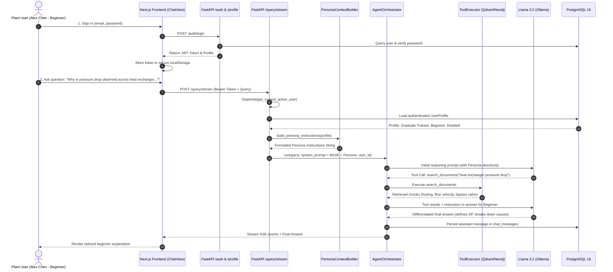
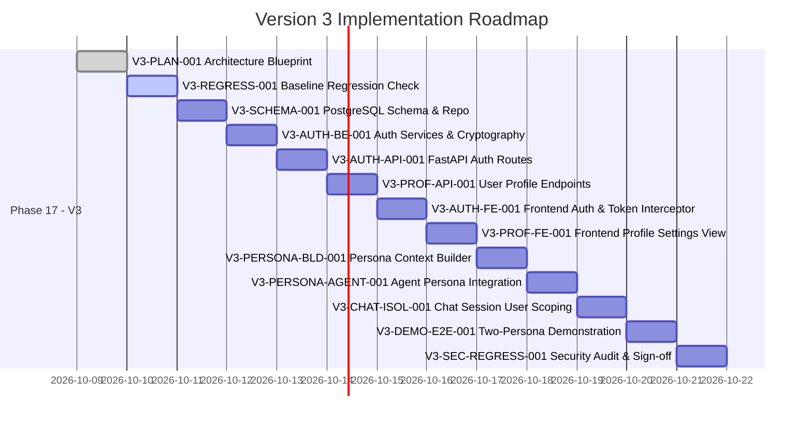

# Docs/version 3.md

# VigilOps Version 3 — Technical Blueprint & Implementation Specification
**Document Version:** 3.0.0  
**Status:** Architecture Blueprint (Approved Architecture Freeze)  
**Date:** October 2026  
**Target System:** VigilOps (OmniOps Engine) — Industrial Intelligence Platform  

---

## 1. Executive Summary

VigilOps is an Industrial Intelligence Platform that transforms complex, heterogeneous plant engineering documents (SOPs, P&IDs, OEM manuals, maintenance work orders, inspection logs) into an active, continuously evolving organizational memory. It combines a Neo4j Knowledge Graph, a Qdrant Vector Database, deterministic Python sandboxed calculation, vision processing, and stateful agentic reasoning (Llama 3.2 via Ollama) into a single operational brain.

**Version 3** introduces two core capabilities without altering the underlying industrial knowledge architecture:
1. **Authentication & User Profile Management:** Multi-user isolation, credential security, session persistence, and persistent user profiles capturing industrial domain expertise, roles, and communication preferences.
2. **Persona-Aware AI Responses:** A dynamic persona-context builder that tailors AI explanations, vocabulary, technical depth, and presentation to the specific expertise of the authenticated user—ranging from entry-level Graduate Trainees to veteran Senior Process Engineers—while querying the exact same underlying knowledge base and strictly preserving all industrial safety warnings and evidence grounding.

### Mandatory Architecture Freeze Compliance
The existing VigilOps architecture is **frozen**. Version 3 is purely additive:
- **No replacement** of existing databases (PostgreSQL, Neo4j, Qdrant, Redis).
- **No changes** to the AI model stack (Llama 3.2, Gemma 3, all-MiniLM-L6-v2/bge-m3).
- **No changes** to the document ingestion pipeline, graph schema, or calculation sandbox.
- **No parallel knowledge silos**: both beginner and expert personas access the identical knowledge graph and vector collections. Personalization occurs strictly during answer synthesis.

---

## 2. Current VigilOps Architecture — Verified From the Repository

The current architecture has been verified through inspection of repository code, configuration files, and test suites.

```mermaid
flowchart TD
    subgraph Client["Frontend (Next.js 16 + React 19)"]
        UI[Unified Interface]
        Nav[NavRail: Chat / Knowledge / Ingestion / Overview]
        ChatView[ChatView + AgentActivityStream]
        ApiClient[ApiClient (services/api.ts)]
    end

    subgraph API["FastAPI Backend (Port 8000)"]
        FastAPIApp[FastAPI main.py]
        Lifespan[Lifespan Connection Pool]
        
        subgraph Routes["API Routes (api/routes/)"]
            R_Health[health.py]
            R_Docs[documents.py]
            R_Uploads[uploads.py]
            R_Query[query.py - /query & /query/stream]
            R_Knowledge[knowledge.py]
            R_Chat[chat.py - /chat/sessions]
        end

        subgraph CoreRuntimes["Reasoning Runtimes"]
            AgentOrch[AgentOrchestrator (agents/orchestrator.py)]
            LegacyOrch[QueryOrchestrator (query/orchestrator.py)]
        end

        subgraph AgentTools["Agent Tool Registry (5 Tools)"]
            T_SearchDocs[search_documents.py]
            T_SearchGraph[search_graph.py]
            T_Calc[calculate.py -> SubprocessSandbox]
            T_Img[analyze_image.py -> Gemma 3]
            T_PID[analyze_pid.py -> Gemma 3]
        end
    end

    subgraph DataStorage["Data & State Layer"]
        PG[(PostgreSQL 16: documents, jobs, chat_sessions, chat_messages)]
        Neo4j[(Neo4j 5.22: Industrial Knowledge Graph)]
        Qdrant[(Qdrant 1.10: Chunk Vector Embeddings)]
        Redis[(Redis 7 + RQ: Asynchronous Ingestion Queue)]
        FileStore[(Local Storage /data/storage: Raw Files & Images)]
    end

    subgraph ModelServing["Local AI Inference (Ollama)"]
        Llama[Llama 3.2: Reasoning & Function Calling]
        Gemma[Gemma 3 4B: Vision & P&ID Analysis]
        ST[SentenceTransformers: all-MiniLM-L6-v2 Embeddings]
    end

    %% Wiring
    UI --> Nav
    UI --> ChatView
    ChatView --> ApiClient
    ApiClient -->|REST / SSE| FastAPIApp
    FastAPIApp --> Routes
    R_Query -->|Agent Mode (Default)| AgentOrch
    R_Query -->|Legacy Fallback| LegacyOrch
    AgentOrch --> AgentTools
    AgentOrch --> Llama
    AgentOrch --> PG
    AgentTools --> Qdrant
    AgentTools --> Neo4j
    AgentTools --> Gemma
    R_Chat --> PG
    R_Docs --> PG
    R_Docs --> FileStore
```

### 2.1 Verified Component Breakdown

| Layer | Verified Technology | Existing File Reference | Status & Details |
|---|---|---|---|
| **Frontend Framework** | Next.js 16.2.10, React 19.2.4, Tailwind CSS v4, Framer Motion 12.42 | `frontend/package.json`, `frontend/src/app/page.tsx` | Single-page UI with `NavRail` (`chat`, `knowledge`, `ingestion`, `overview`). Live SSE streaming for agent activities. |
| **API Transport** | FastAPI 0.115.0, Uvicorn 0.30.6 | `backend/main.py`, `backend/dependencies.py` | Central CORS middleware, connection pool lifespan, dependency injection. |
| **Relational DB** | PostgreSQL 16 (psycopg 3.2.13) | `backend/database/repositories.py`, `backend/database/chat_repository.py` | Raw `psycopg` connection using DSN. Tables initialized dynamically via `_ensure_tables`. Existing tables: `documents`, `ingestion_jobs`, `ingestion_job_events`, `chat_sessions`, `chat_messages`. |
| **Knowledge Graph** | Neo4j 5.22 / 5.28 (Bolt protocol) | `backend/graph/neo4j_repository.py`, `backend/graph/query_service.py` | Explicit industrial relations (`HAS_COMPONENT`, `INSPECTED`, `CONNECTS_TO`, `AFFECTS`). |
| **Vector DB** | Qdrant 1.10.1 / 1.13.2 | `backend/vector/qdrant_repository.py` | Cosine similarity chunk search. Default embedding: `all-MiniLM-L6-v2`. |
| **Background Queue** | Redis 7 + RQ 1.16.2 | `backend/worker.py`, `backend/ingestion/orchestrator.py` | Asynchronous file parsing, OCR, chunking, graph resolution. |
| **Agent Runtime** | Custom ReAct Loop with Llama 3.2 | `backend/agents/orchestrator.py`, `backend/agents/ollama_agent_provider.py` | Function-calling loop with 5 tools (`search_documents`, `search_knowledge_graph`, `calculate`, `analyze_image`, `analyze_pid`). Max iterations: 8. SSE live activity stream via `utils/event_bus.py`. |
| **Calculation Sandbox** | Deterministic Subprocess | `backend/calculation/subprocess_sandbox.py`, `backend/calculation/validator.py` | Isolated Python execution for engineering equations, unit conversions, and heat/mass balances. |
| **Vision Inference** | Ollama Gemma 3 4B | `backend/generation/vision_provider.py` | Visual inspection of equipment tags, dials, and P&ID diagrams. |
| **Current Auth State** | Completely unauthenticated | All backend routes | Open access; chat sessions have no user ID binding. |

### 2.2 Trace of a User Query Through the Existing System

1. **User Action:** The user types `"What is the pressure drop across heat exchanger E-101?"` into `ChatView.tsx`.
2. **API Call:** `ApiClient.queryStream` posts JSON payload `{ "query": "...", "session_id": "..." }` to `POST /query/stream`.
3. **Session Check:** `api/routes/query.py` creates or loads `session_id` via `ChatRepository`. User message is saved to PostgreSQL `chat_messages`.
4. **Agent Execution:**
   - `AgentOrchestrator.run()` is called with `_SYSTEM_PROMPT`.
   - Initial messages array is populated:
     - `{"role": "system", "content": _SYSTEM_PROMPT}`
     - Prior conversation history (last 10 turns) loaded from `ChatRepository`
     - Current query: `{"role": "user", "content": query}`
   - Llama 3.2 inspects the prompt and emits tool call `search_knowledge_graph(query="E-101")` or `search_documents(query="E-101 pressure drop")`.
   - `ToolExecutor` runs the tool asynchronously and captures results.
   - An activity event (e.g., `"Searching technical documents for 'E-101 pressure drop'..."`) is published to `bus.publish("query_{session_id}", event)`.
   - Results are fed back into Llama 3.2 message history.
   - Llama 3.2 reasons over retrieved chunks and graph edges, synthesizes the final answer, and adds source citations (`[Context #1]`).
5. **Streaming & Client Render:** SSE stream transmits events to `AgentActivityStream.tsx`, and the final answer is persisted in `chat_messages` and rendered in `ChatView.tsx`.

---

## 3. Architecture Freeze and Non-Negotiable Constraints

To protect the stability and production readiness of VigilOps, all engineers and automated coding agents must adhere strictly to the **Architecture Freeze**:

### 3.1 Prohibited Changes (Explicit Authorization Required)
1. **No Database Migration or Replacement:** Do NOT replace PostgreSQL with MySQL, SQLite, MongoDB, or Supabase. Do NOT replace Neo4j or Qdrant.
2. **No Model Stack Alteration:** Do NOT replace Ollama Llama 3.2 or Gemma 3 with external unapproved LLM providers or framework wrappers (e.g., do NOT install LangChain, CrewAI, AutoGen, or LangGraph).
3. **No Ingestion Redesign:** Do NOT modify the chunking algorithms, document parsers, or RQ background workers.
4. **No Rewriting Working Interfaces:** Do NOT replace Next.js with another frontend framework or re-architect the CSS/Tailwind design system.
5. **No Direct Frontend-to-Database Connections:** The frontend must NEVER connect directly to PostgreSQL, Neo4j, or Qdrant.

### 3.2 Permitted Changes (Additive Only)
1. **Authentication:** Add identity tables (`users`), token generation, password hashing, and authentication dependencies to FastAPI.
2. **Profiles:** Add `user_profiles` table, schema definitions, and profile management endpoints (`/profile`).
3. **Prompt Enhancement:** Add `PersonaContextBuilder` to inject authoritative persona instructions into `_SYSTEM_PROMPT` in `AgentOrchestrator` and `PromptBuilder`.
4. **UI Additions:** Add sign-in/sign-up components, a dedicated User Profile page/tab, and token handling in `ApiClient`.
5. **Session Scoping:** Bind `chat_sessions` to the authenticated user ID so users only access their own history.

---

## 4. Version 3 Goals and Non-Goals

### 4.1 Goals
- **G-1:** Allow industrial plant users to securely register, sign in, maintain active sessions, and log out.
- **G-2:** Store and maintain editable user profiles describing role (`designation`), skills (`skill_set`), refinery experience level (`beginner`, `intermediate`, `advanced`, `expert`), and explanation depth preference (`concise`, `moderate`, `detailed`).
- **G-3:** Automatically incorporate the authenticated user's persona into every AI query so explanations dynamically adapt to the user's expertise level.
- **G-4:** Provide a reproducible two-persona test demonstration proving that two users with different profiles asking the exact same question receive appropriately tailored answers from the identical knowledge base.
- **G-5:** Ensure complete multi-tenant user data segregation without cross-user leakage.
- **G-6:** Maintain 100% backwards compatibility and pass all 537 existing regression tests.

### 4.2 Non-Goals
- **NG-1: Persona-based document partitioning.** All users have access to the full plant technical documentation; persona does NOT filter the knowledge base.
- **NG-2: Omission of critical safety protocols.** Experience level must NEVER suppress mandatory hazard alerts, PPE requirements, or regulatory warnings.
- **NG-3: Automatic persona drift.** The persona remains determined by the user's explicit profile settings, not inferred on the fly by ungrounded heuristic guesses.

---

## 5. Proposed Additive Changes and Data Flow

### 5.1 End-to-End Persona Query Data Flow



---

## 6. Authentication Design

### 6.1 Authentication Architecture
- **Stateless Bearer Authentication (JWT):** The frontend sends an HTTP header `Authorization: Bearer <token>` on all protected API calls.
- **Password Security:** Salted, collision-resistant password hashing using standard library PBKDF2-HMAC-SHA256 (600,000 iterations, 32-byte salt) or `argon2-cffi` if external package addition is approved.
- **Identity Isolation:** Passwords and credentials live in a dedicated `users` table; domain metadata lives in `user_profiles`.

### 6.2 Token Payload Specification
```json
{
  "sub": "usr_9b1deb4d-3b7d-4bad-9bdd-2b0d7b3dcb6d",
  "email": "alex.chen@refinery.internal",
  "exp": 1775724800,
  "iat": 1775638400
}
```

### 6.3 Backend Authentication Dependency (`get_current_user`)
FastAPI dependency injection will validate tokens using `HTTPBearer`:
```python
from fastapi import Depends, HTTPException, status
from fastapi.security import HTTPBearer, HTTPAuthorizationCredentials
import jwt

security = HTTPBearer()

def get_current_user(
    credentials: HTTPAuthorizationCredentials = Depends(security),
    user_repo: UserRepository = Depends(get_user_repo)
) -> User:
    token = credentials.credentials
    try:
        payload = decode_access_token(token)
        user_id = payload.get("sub")
        if not user_id:
            raise HTTPException(status_code=401, detail="Invalid token payload")
        user = user_repo.get_user_by_id(user_id)
        if not user or not user.is_active:
            raise HTTPException(status_code=401, detail="User inactive or not found")
        return user
    except jwt.PyJWTError:
        raise HTTPException(status_code=401, detail="Invalid or expired token")
```

---

## 7. User Persona and Profile Design

### 7.1 Field Definitions and Schema Types

| Field | PostgreSQL Type | Required | Description & Constraints |
|---|---|---|---|
| `user_id` | `TEXT` | Yes | Primary key referencing `users(user_id) ON DELETE CASCADE`. |
| `name` | `TEXT` | Yes | Preferred display name (e.g., "Alex Chen"). |
| `skill_set` | `JSONB` | Yes | Array of domain skills (e.g., `["Basic engineering", "Safety fundamentals"]`). Default `'[]'::jsonb`. |
| `designation` | `TEXT` | Yes | Professional role (e.g., "Graduate Trainee", "Senior Process Engineer"). |
| `refinery_experience_level`| `TEXT` | Yes | Experience level. Must be one of: `'beginner'`, `'intermediate'`, `'advanced'`, `'expert'`. |
| `preferred_explanation_depth`| `TEXT` | Yes | Depth preference. Must be one of: `'concise'`, `'moderate'`, `'detailed'`. |
| `created_at` | `TIMESTAMPTZ` | Yes | Profile creation timestamp in UTC. |
| `updated_at` | `TIMESTAMPTZ` | Yes | Last update timestamp in UTC. |

### 7.2 Justification for JSONB for `skill_set`
- **Native JSON Serialization:** Integrates cleanly with Pydantic (`list[str]`) and JavaScript without custom PostgreSQL array parsing (`TEXT[]`).
- **Query Flexibility:** Supports JSON containment operators (`skill_set @> '["Safety fundamentals"]'`).
- **Consistency:** Follows existing JSONB conventions in `chat_messages` (`citations JSONB`, `metadata JSONB`).

### 7.3 Experience Level Definitions

```text
┌─────────────────────────────────────────────────────────────────────────────┐
│                       REFINERY EXPERIENCE SPECTRUM                          │
├─────────────────┬───────────────────┬──────────────────┬────────────────────┤
│    BEGINNER     │   INTERMEDIATE    │     ADVANCED     │       EXPERT       │
├─────────────────┼───────────────────┼──────────────────┼────────────────────┤
│ • Graduate      │ • Field Operator  │ • Reliability    │ • Senior Process   │
│   Trainees      │ • Maintenance     │   Engineer       │   Engineer         │
│ • Unfamiliar    │   Tech            │ • Familiar with  │ • Deep unit & loop │
│   with acronyms │ • Knows equipment │   abnormal plant │   troubleshooting  │
│ • Needs terms & │   types & units   │   conditions &   │ • Expects high     │
│   operating     │ • Standard flow & │   diagnostics    │   density, no      │
│   principles    │   procedures      │ • Focuses on P&ID│   remedial terms   │
│   defined       │   explained       │   & loop trends  │ • Direct checklist │
└─────────────────┴───────────────────┴──────────────────┴────────────────────┘
```

### 7.4 Safe Fallback Defaults
If a user signs in but has not yet completed their profile, the system applies a safe, neutral default:
- `refinery_experience_level`: `"intermediate"`
- `preferred_explanation_depth`: `"moderate"`
- `designation`: `"Plant Personnel"`
- `skill_set`: `["General Operations"]`

---

## 8. PostgreSQL Schema and Migration Strategy

### 8.1 Schema Definition SQL

In strict compliance with repository conventions (`_ensure_tables` in repository classes), the schema will be initialized via `backend/database/user_repository.py`:

```sql
-- 1. Identity & Credentials Table
CREATE TABLE IF NOT EXISTS users (
    user_id TEXT PRIMARY KEY,
    email TEXT UNIQUE NOT NULL,
    password_hash TEXT NOT NULL,
    is_active BOOLEAN NOT NULL DEFAULT TRUE,
    created_at TIMESTAMPTZ NOT NULL,
    updated_at TIMESTAMPTZ NOT NULL
);

CREATE INDEX IF NOT EXISTS idx_users_email ON users (email);

-- 2. Domain Profile Table
CREATE TABLE IF NOT EXISTS user_profiles (
    user_id TEXT PRIMARY KEY,
    name TEXT NOT NULL,
    skill_set JSONB NOT NULL DEFAULT '[]'::jsonb,
    designation TEXT NOT NULL,
    refinery_experience_level TEXT NOT NULL CHECK (
        refinery_experience_level IN ('beginner', 'intermediate', 'advanced', 'expert')
    ),
    preferred_explanation_depth TEXT NOT NULL CHECK (
        preferred_explanation_depth IN ('concise', 'moderate', 'detailed')
    ),
    created_at TIMESTAMPTZ NOT NULL,
    updated_at TIMESTAMPTZ NOT NULL,
    FOREIGN KEY (user_id) REFERENCES users (user_id) ON DELETE CASCADE
);

CREATE INDEX IF NOT EXISTS idx_user_profiles_user_id ON user_profiles (user_id);

-- 3. Additive Multi-Tenant Link to Existing chat_sessions
ALTER TABLE chat_sessions ADD COLUMN IF NOT EXISTS user_id TEXT REFERENCES users (user_id) ON DELETE CASCADE;
CREATE INDEX IF NOT EXISTS idx_chat_sessions_user_id ON chat_sessions (user_id);
```

### 8.2 Ownership and Authorization Policy
Since OmniOps uses a single pooled PostgreSQL role (`omniops`) without Row-Level Security (RLS), **application-level ownership verification** is enforced in the repository layer:
- A user can only read/update their own profile (`WHERE user_id = %s`).
- `GET /chat/sessions` returns only sessions matching `current_user.user_id`.
- Attempts to query another user's session ID return `HTTP 403 Forbidden` or `HTTP 404 Not Found`.

---

## 9. Backend API and Module Changes

### 9.1 New API Endpoints (`backend/api/routes/auth.py` & `profile.py`)

#### `POST /auth/register`
- **Purpose:** Create new user identity and initial user profile.
- **Request Body:**
  ```json
  {
    "email": "alex.chen@refinery.internal",
    "password": "SecurePassword123!",
    "name": "Alex Chen",
    "designation": "Graduate Trainee",
    "skill_set": ["Basic engineering", "Safety fundamentals"],
    "refinery_experience_level": "beginner",
    "preferred_explanation_depth": "detailed"
  }
  ```
- **Response (201 Created):**
  ```json
  {
    "access_token": "eyJhbGciOiJIUzI1NiIs...",
    "token_type": "bearer",
    "user": {
      "user_id": "usr_9b1deb4d-3b7d-4bad-9bdd-2b0d7b3dcb6d",
      "email": "alex.chen@refinery.internal",
      "name": "Alex Chen",
      "designation": "Graduate Trainee"
    }
  }
  ```

#### `POST /auth/login`
- **Purpose:** Authenticate credentials and return JWT bearer token.
- **Request Body:**
  ```json
  {
    "email": "alex.chen@refinery.internal",
    "password": "SecurePassword123!"
  }
  ```
- **Response (200 OK):** Same token structure as register.

#### `GET /auth/me`
- **Purpose:** Return current authenticated user and profile.
- **Headers:** `Authorization: Bearer <token>`
- **Response (200 OK):** User object with embedded profile.

#### `GET /profile`
- **Purpose:** Retrieve the authenticated user's profile.
- **Headers:** `Authorization: Bearer <token>`
- **Response (200 OK):**
  ```json
  {
    "user_id": "usr_9b1deb4d-3b7d-4bad-9bdd-2b0d7b3dcb6d",
    "name": "Alex Chen",
    "skill_set": ["Basic engineering", "Safety fundamentals"],
    "designation": "Graduate Trainee",
    "refinery_experience_level": "beginner",
    "preferred_explanation_depth": "detailed",
    "created_at": "2026-10-09T12:00:00Z",
    "updated_at": "2026-10-09T12:00:00Z"
  }
  ```

#### `PUT /profile`
- **Purpose:** Update the authenticated user's profile. Changes take effect on subsequent queries immediately.
- **Request Body:** Partial or complete profile fields.
- **Response (200 OK):** Updated profile object.

### 9.2 Modified Existing Endpoints
- **`POST /query` & `POST /query/stream`:**
  - Added dependency: `current_user: User = Depends(get_current_user)`.
  - Backend retrieves profile via `UserRepository.get_profile(current_user.user_id)`.
  - Passes persona instructions to `AgentOrchestrator.run()`.
- **`GET /chat/sessions`:**
  - Filters sessions by `user_id = current_user.user_id`.

---

## 10. Frontend Authentication and Profile UI

### 10.1 Navigation and Layout Additions
The existing `NavRail.tsx` will be extended additively with a new navigation item:
```typescript
{ id: "profile", label: "Profile", icon: UserCircle }
```
When `activeView === "profile"`, `frontend/src/app/page.tsx` renders `<ProfileView />`.

### 10.2 Frontend View Architecture

```text
┌─────────────────────────────────────────────────────────────────────────────┐
│ VIGILOPS APPLICATION SHELL                                                 │
├──────┬──────────────────────────────────────────────────────────────────────┤
│ NAV  │ [Active User: Alex Chen (Graduate Trainee)]            [Sign Out]    │
│ RAIL ├──────────────────────────────────────────────────────────────────────┤
│      │                                                                      │
│ Chat │ User Profile & Persona Settings                                      │
│      │ ──────────────────────────────────────────────────────────────────── │
│ Know │ Full Name:               [ Alex Chen                               ] │
│      │ Designation:             [ Graduate Trainee                        ] │
│ Ings │ Skill Set (tags):        [ Basic engineering ] [ Safety ] [+ Add]    │
│      │ Experience Level:        (●) Beginner  ( ) Intermediate              │
│ Over │                          ( ) Advanced  ( ) Expert                    │
│      │ Explanation Depth:       ( ) Concise   ( ) Moderate  (●) Detailed    │
│ Prof │                                                                      │
│      │                          [ Save Profile Changes ]                    │
└──────┴──────────────────────────────────────────────────────────────────────┘
```

### 10.3 API Client Interceptor Integration (`frontend/src/services/api.ts`)
`ApiClient.request` and `ApiClient.queryStream` will automatically inject the JWT from `localStorage`:
```typescript
const token = typeof window !== "undefined" ? localStorage.getItem("omniops_jwt_token") : null;
if (token) {
  headers.set("Authorization", `Bearer ${token}`);
}
```
If an API response returns `401 Unauthorized`, the client clears the token and triggers the login modal/view.

---

## 11. Persona-Context Construction and Prompt Integration

### 11.1 PersonaContextBuilder (`backend/generation/persona_builder.py`)

The builder produces an authoritative, structured directive block:

```python
class PersonaContextBuilder:
    @staticmethod
    def build(profile: UserProfile) -> str:
        level = profile.refinery_experience_level.lower()
        depth = profile.preferred_explanation_depth.lower()
        skills = ", ".join(profile.skill_set) or "General engineering"
        
        guidance = {
            "beginner": (
                "- The user is a beginner in refinery operations. Explain foundational concepts and operational principles clearly.\n"
                "- Define all technical acronyms, differential terms, and industrial shorthand (e.g., DP, P&ID, fouling).\n"
                "- Structure troubleshooting checks in a logical, step-by-step diagnostic sequence.\n"
                "- Use accessible, intuitive explanations without omitting physical mechanisms."
            ),
            "intermediate": (
                "- The user has working familiarity with plant operations. Standard refinery terminology may be used without exhaustive definitions.\n"
                "- Provide clear, structured diagnostic workflows referencing typical unit operations."
            ),
            "advanced": (
                "- The user possesses extensive engineering and practical operations background.\n"
                "- Focus on detailed process variables, control loop dynamics, and unit-specific parameters.\n"
                "- Do not define standard equipment types or fundamental engineering concepts."
            ),
            "expert": (
                "- The user is a senior industrial expert. Provide concise, high-density technical analysis.\n"
                "- Focus directly on differential pressure curves, Reynolds numbers, fouling factors, telemetry, and specific valve/piping restrictions.\n"
                "- Omit introductory definitions and basic operational principles entirely.\n"
                "- Deliver prioritized technical action items."
            ),
        }.get(level, "")

        depth_instruction = {
            "concise": "Keep the response focused, direct, and concise. Prioritize key diagnostic data over narrative elaboration.",
            "moderate": "Provide balanced technical explanations with adequate context and diagnostic steps.",
            "detailed": "Provide thorough, in-depth analysis covering operating mechanisms, potential causes, and detailed inspection procedures."
        }.get(depth, "")

        return (
            "--- USER EXPERTISE & PERSONA DIRECTIVES ---\n"
            f"User Role: {profile.designation}\n"
            f"Declared Skills: {skills}\n"
            f"Experience Level: {profile.refinery_experience_level.upper()}\n"
            f"Preferred Depth: {profile.preferred_explanation_depth.upper()}\n\n"
            f"COMMUNICATION RULES:\n"
            f"{guidance}\n"
            f"{depth_instruction}\n"
            "MANDATORY SAFETY CONSTRAINT: Never omit hazardous material warnings, high-pressure precautions, PPE requirements, or Lockout/Tagout procedures regardless of the user's expertise level.\n"
            "GROUNDING CONSTRAINT: Ground all technical facts in retrieved evidence. Do not invent plant equipment or operational data.\n"
            "---------------------------------------------"
        )
```

### 11.2 Integration Into `AgentOrchestrator`
In `backend/agents/orchestrator.py`:
```python
# System prompt constructed dynamically
effective_system_prompt = f"{self._system_prompt}\n\n{persona_instructions}"
state.messages.append({
    "role": "system",
    "content": effective_system_prompt,
})
```

---

## 12. Same-Question, Two-Persona Demonstration

### 12.1 Canonical Demonstration Test Question
Both test users will submit the identical question:
> **"Why is a pressure drop observed across a heat exchanger, and what should be checked to investigate it?"**

### 12.2 Persona Configurations
- **User A (Beginner):**
  - Name: `"Alex Chen"`
  - Designation: `"Graduate Trainee"`
  - Skill Set: `["Basic engineering", "Safety fundamentals"]`
  - Experience Level: `"beginner"`
  - Preferred Depth: `"detailed"`

- **User B (Senior Professional):**
  - Name: `"Dr. Marcus Vance"`
  - Designation: `"Senior Process Engineer"`
  - Skill Set: `["Process engineering", "Refinery operations", "Equipment troubleshooting"]`
  - Experience Level: `"expert"`
  - Preferred Depth: `"concise"`

### 12.3 Expected Output Divergence Breakdown

```text
┌─────────────────────────────────────────────────────────────────────────────┐
│                         SAME-QUESTION DIVERGENCE                            │
├──────────────────────────────────────┬──────────────────────────────────────┤
│      PERSONA A (GRADUATE TRAINEE)    │   PERSONA B (SENIOR PROCESS ENGINEER)│
├──────────────────────────────────────┼──────────────────────────────────────┤
│ 1. Concept Introduction:             │ 1. Direct Diagnostic Summary:        │
│    "In refinery operations, pressure │    "Differential pressure (ΔP) spike │
│    drop (often written as ΔP) is the │    across heat exchanger indicates   │
│    difference in fluid pressure      │    either hydraulic restriction or   │
│    between the inlet and outlet..."  │    severe surface fouling."          │
│                                      │                                      │
│ 2. Equipment Mechanism Explained:    │ 2. Focus on Process Parameters:      │
│    Explains tube-side vs shell-side  │    Immediately targets fouling factor│
│    flow and why restrictions occur.  │    margin, velocity drop, and        │
│                                      │    Reynolds regime shifts.           │
│ 3. Plain English Causes:             │                                      │
│    • Scaling / crud buildup (fouling)│ 3. Technical Root Causes:            │
│    • Closed or throttled valves      │    • Tube-side bio/particulate fouling│
│    • Trapped gas or air bubbles      │    • Shell-side baffle impingement    │
│                                      │    • Control valve position mismatch  │
│ 4. Step-by-Step Diagnostic Sequence: │                                      │
│    Numbered list starting with easy  │ 4. Prioritized Diagnostic Protocol:  │
│    visual checks, pressure gauges.   │    Check ΔP telemetry trend, valve   │
│                                      │    Cv, backflush line, thermal duty. │
│ 5. Definitions Included:             │                                      │
│    Defines DP transmitters & P&ID.   │ 5. Zero Remedial Definitions:        │
│                                      │    No explanation of what an E-101   │
│ 6. Safety Warning Preserved:         │    heat exchanger is.                │
│    "CAUTION: Never open bleeder      │                                      │
│    valves without verifying thermal  │ 6. Safety Warning Preserved:         │
│    relief and wearing PPE."          │    "SAFETY: Confirm depressurization │
│                                      │    and thermal relief valve lineup." │
└──────────────────────────────────────┴──────────────────────────────────────┘
```

### 12.4 Two-Persona Comparative Evaluation Matrix

| Evaluation Dimension | Persona A (Beginner) | Persona B (Expert) | Verification Target |
|---|---|---|---|
| **Terminology Explanations** | Explicitly defines $\Delta P$, fouling, shell/tube sides | Zero remedial definitions | Pass |
| **Response Length** | Detailed (400–600 words) | Concise (150–250 words) | Pass |
| **Technical Depth** | High-level physical intuition | Process variables, Reynolds, fouling factors | Pass |
| **Evidence Grounding** | Grounded in retrieved plant docs | Grounded in identical retrieved plant docs | Pass (same citations) |
| **Factual Consistency** | Accurately describes heat exchanger | Accurately describes heat exchanger | Pass |
| **Diagnostic Utility** | Sequential educational checklist | Prioritized operational checks | Pass |
| **Safety Compliance** | Highlights pressure hazards and PPE | Highlights pressure hazards and PPE | Pass (100% preserved) |

---

## 13. Testing and Evaluation Strategy

### 13.1 Automated Test Suites to Implement (`backend/tests/`)
1. `test_user_repository.py`: CRUD operations for `users` and `user_profiles`, duplicate email handling, cascade deletes.
2. `test_auth_service.py`: Password hashing, verification, token issuance, expired token rejection.
3. `test_persona_builder.py`: Validates generated persona directives across all 4 experience levels and 3 depth settings.
4. `test_profile_api.py`: Tests `/auth/register`, `/auth/login`, `/profile` endpoints with mock database fixtures.
5. `test_persona_query_integration.py`: End-to-end integration test verifying that queries submitted by Beginner and Expert users receive distinct responses while preserving safety alerts.

### 13.2 Baseline Regression Verification
The entire existing test suite must continue to run and pass cleanly:
```powershell
.\.venv\Scripts\python.exe -m unittest discover -s tests
```
*Current verified baseline: 537 tests passing.*

---

## 14. Security, Privacy, and Industrial Safety

1. **Password Protection:** Passwords are never stored in plaintext or logged. Passwords hashed using PBKDF2-HMAC-SHA256 (600,000 iterations) or Argon2id with unique cryptographic salts.
2. **Token Security:** JWT tokens signed with a 256-bit secret stored in `.env` (`AUTH_SECRET_KEY`). Tokens expire after 24 hours.
3. **Prompt Injection Defense:** User profile strings (`name`, `designation`, `skill_set`) are sanitized before being placed into system instructions. Unsanitized user inputs cannot break out of persona blocks.
4. **Log Sanitization:** `_sanitize_arguments` in `orchestrator.py` already redacts keys matching `password`, `token`, `secret`, `key`. This rule is maintained for all authentication events.
5. **Safety Invariance:** An industrial prompt rule enforces that:
   > *"Under no circumstances shall the user's experience level allow the omission of safety-critical warnings, hazardous chemical notices, or emergency shutdown procedures."*

---

## 15. Phased Implementation Roadmap



---

## 16. Exact File-by-File Change Plan

### 16.1 New Files to Create

| File Path | Component Responsibility |
|---|---|
| `backend/database/user_repository.py` | PostgreSQL persistence for `users` and `user_profiles` tables via raw `psycopg` connection, matching `repositories.py`. |
| `backend/services/auth_service.py` | Password hashing, verification, JWT generation, and token validation logic. |
| `backend/generation/persona_builder.py` | `PersonaContextBuilder` class converting `UserProfile` into structured LLM persona instructions. |
| `backend/api/routes/auth.py` | FastAPI router for `/auth/register`, `/auth/login`, and `/auth/me`. |
| `backend/api/routes/profile.py` | FastAPI router for `GET /profile` and `PUT /profile`. |
| `backend/tests/test_user_repository.py` | Unit tests for user and profile database operations. |
| `backend/tests/test_auth_service.py` | Unit tests for password cryptography and token life cycles. |
| `backend/tests/test_persona_builder.py` | Unit tests verifying persona prompt formatting across experience levels. |
| `backend/tests/test_persona_query_integration.py` | Integration tests verifying persona injection into query flows. |
| `frontend/src/components/ProfileView.tsx` | Next.js/React component for editing profile, designation, skills, and experience level. |
| `frontend/src/components/AuthModal.tsx` | Modal/view for user sign-in and account registration. |

### 16.2 Existing Files to Modify

| File Path | Planned Modifications |
|---|---|
| `backend/config/settings.py` | Add `AuthSettings` class (`secret_key`, `algorithm`, `access_token_expire_minutes`) loaded from `.env`. |
| `backend/main.py` | Register `auth_router` and `profile_router` with FastAPI app instance. |
| `backend/dependencies.py` | Export `get_user_repo()`, `get_auth_service()`, and `get_current_user()` dependencies. |
| `backend/api/routes/query.py` | Require `Depends(get_current_user)`, retrieve user profile, pass persona string to orchestrators. |
| `backend/api/routes/chat.py` | Scope `GET /chat/sessions` to `current_user.user_id`. |
| `backend/agents/orchestrator.py` | Accept optional `persona_instructions` parameter in `run()`, injecting it into the initial system message. |
| `frontend/src/services/api.ts` | Add auth endpoints (`login`, `register`, `getProfile`, `updateProfile`) and bearer token request header interceptor. |
| `frontend/src/components/NavRail.tsx` | Add `"profile"` item to `NAV_ITEMS` with User icon. |
| `frontend/src/app/page.tsx` | Add state for `currentUser`, handle `"profile"` view, render `ProfileView` and `AuthModal`. |

---

## 17. Risks, Edge Cases, and Mitigations

| Risk / Edge Case | Impact | Mitigation Strategy |
|---|---|---|
| **Incomplete User Profile** | User signs in but leaves experience level blank. | Apply robust default persona (`intermediate` + `moderate`) without failing. |
| **Token Expiration Mid-Session** | User submitting long query or SSE stream when token expires. | Frontend detects `401` event, prompts user to re-authenticate, and preserves unsent message draft in local state. |
| **Prompt Injection via Profile Fields** | User enters malicious text into `designation` (e.g., `"Ignore previous instructions"`). | Strict validation: length limits (max 50 chars), regex sanitization, and enclosing profile fields within rigid structural delimiters. |
| **Safety Warning Omission by LLM** | Model assumes expert does not need hazard warnings. | Strict negative constraint in persona system prompt: *"Never omit safety precautions regardless of experience level."* |
| **Database Disconnection** | PostgreSQL restarts during profile update. | Standard retry logic and connection re-initialization already built into repository `_connect()`. |

---

## 18. Acceptance Criteria and Definition of Done

A Version 3 implementation task is considered complete **only** when all of the following criteria are satisfied:
1. `users` and `user_profiles` tables are created in PostgreSQL with proper constraints and foreign keys.
2. A new user can register, receive a JWT token, log in, and log out.
3. Unauthenticated requests to protected endpoints (`/profile`, `/query`) receive `401 Unauthorized`.
4. User profile can be updated via UI and persists after page reload.
5. Cross-user access is impossible: User A cannot read or modify User B's profile or chat sessions.
6. The Two-Persona Demonstration runs against the identical test question:
   - Both users query the exact same knowledge base and receive responses using the same citations.
   - The Beginner receives an accessible, step-by-step explanation defining basic terms.
   - The Expert receives a concise, high-density technical analysis without remedial definitions.
   - Both responses retain all mandatory safety precautions.
7. All 537 existing unit tests pass without errors.
8. No application source code outside the approved additive change list was altered.

---

## 19. Optional Future Enhancements

The following features are cataloged for consideration in future versions (Version 4+) and are **not** part of Version 3:
- **Role-Based Access Control (RBAC) for Documents:** Granular permissions restricting certain confidential plant units to certified engineers.
- **Dynamic Skill Assessment:** Automated detection of user familiarity based on conversation history and calculation tool usage.
- **Bi-Directional Voice Interface:** Voice input/output tailored for hands-free field technician operations in refinery process units.

---

## 20. Unresolved Assumptions and Approval-Required Decisions

The following architectural choices are formally documented for project owner approval:

### Decision 1: Cryptographic Password Hashing Library
- **Option A (Recommended):** Add `argon2-cffi` or `bcrypt` to `requirements.txt`.
  - *Pros:* Modern industry gold-standard for password hashing with memory-hard resistance against GPU attacks.
  - *Cons:* Requires adding a dependency to `backend/requirements.txt`.
- **Option B (Zero-dependency fallback):** Use Python standard library `hashlib.pbkdf2_hmac` with SHA-256 and 600,000 iterations.
  - *Pros:* 100% compliant with frozen requirements, zero package installation required.
  - *Cons:* Slightly less resistant to specialized ASIC cracking than Argon2id, though fully NIST/FIPS approved.
- *Default Plan:* Implement Option B (PBKDF2) initially so no unauthorized package installation occurs during the freeze, with an abstracted interface ready for Option A upon approval.

### Decision 2: JWT Encoding Library
- **Option A (Recommended):** Add `pyjwt` to `backend/requirements.txt`.
  - *Pros:* Standard JWT implementation with built-in expiration and claims validation.
  - *Cons:* External dependency.
- **Option B (Zero-dependency fallback):** Use Python standard library `hmac` + `hashlib` to create signed base64url bearer tokens.
  - *Pros:* Zero external dependencies, pure standard library.
  - *Cons:* Custom token format instead of standard JWT.
- *Default Plan:* Abstract token generation in `auth_service.py` to allow seamless switching upon explicit owner approval.
